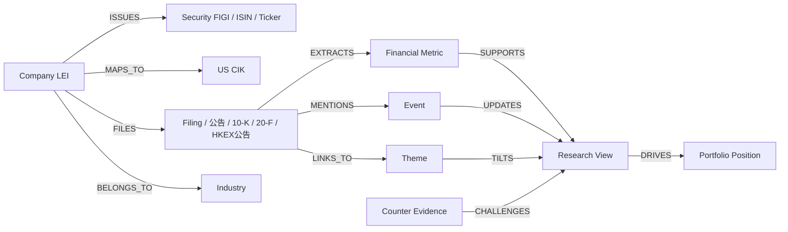

# AI Native 虚拟量化基金组织下一步研究清单

> 状态说明：本文是历史研究底稿，保留原始论证和引用脉络。当前执行口径已调整为“不采购或依赖商业授权数据”，以 `tasks/todo.md`、`docs/product-requirements-document.md`、`docs/api-contracts.md` 和代码中的 `public_*` / `local_reference_*` source governance 为准。

## 执行摘要

从 CEO 视角看，这份“下一步研究清单”不应被当作一组松散课题，而应被管理成一个有明确阶段闸门的落地项目群：先解决**数据权利可用性**与**研究证据可审计性**，再解决**策略可执行性**与**组织可治理性**，最后再做**复杂基础设施升级**。对 A 股、港股、美股三市场而言，最值得优先投入的不是“更快的数据”，而是“可合法持续使用的数据”“可回溯的研究证据链”“可复盘的决策纪律”。公开披露层面，A 股以上市公司在交易所网站及符合监管规定媒体披露的信息为基本真相源，港股以 HKEXnews 为中心化披露平台，美股以 SEC EDGAR 与其 Data APIs 为基础；但行情、非展示使用、衍生数据、研报、会议转录等一旦进入自动化研究与商业化使用，授权边界立刻显著收紧，尤其是美股的 non-display / derived data 和港股的 wholesale market data 许可。citeturn16search1turn16search11turn22search0turn22search9turn40search1turn40search2turn6search10turn6search9turn7search5turn7search19

第二个核心判断是：你现在最需要的不是“更强的大模型”，而是“**中文公告/年报 benchmark + 证据定位能力**”。没有这个 benchmark，产业链分析、市场规模归因、财务口径统一、估值与策略复盘都会变成不可审计的黑箱。公开可用的金融抽取与文档理解基座已经相当成熟：CCKS 系列金融抽取任务可提供中文金融标注方法参考，PaddleOCR/PP-Structure 适合中文 PDF 解析，LayoutLMv3 / LayoutXLM / XFUND 为版面理解和多语种文档理解提供稳健基线；Doccano 可快速搭建标注流程，DocVQA 的 ANLS 与 SQuAD 的 EM/F1 则适合扩展为“术语抽取 + 证据定位”的双层评测。citeturn8search1turn8search9turn9search3turn9search0turn23search10turn24search7turn9search2turn20search3turn20search9turn18search12

第三个判断是：组合与组织治理要同时起步。Black-Litterman 的价值在于把“市场均衡先验”与“研究观点”统一到一个可解释的后验收益框架里，风险预算与行业约束则让 A/H/US 中低频组合更可实施、少极端权重；与此同时，Agent 权限最小化、提示词变更审批、事故剧本、反方自动化和月度经营回顾模板，决定了这个“虚拟量化基金”最后是一个可扩展的研究组织，还是一个靠个人记忆维持的临时系统。联邦储备最新模型风险管理指导仍把“effective challenge”“benchmarking to other models”“outcomes analysis”放在核心位置，这与反方自动化、灰度上线、持续监控的组织设计高度一致。citeturn35view0turn35view1turn35view2turn36view0turn34view1turn34view2turn34view3turn28view2turn28view0

第四个判断是：**阶段一坚持批处理优先，不急于上 Kafka，也不急于引入 Feast。** Feast 的核心价值是 point-in-time correctness、统一 feature registry 以及 offline/online 分离；Kafka 的价值是在多源事件到来时提供可回放、可解耦、可 exactly-once 的事件流。对个人/小团队、以 A/H/US 中低频研究为主的 MVP 来说，这两者都应该由“共享特征与事件复杂度”触发，而不是由“技术好看”触发。建议以 16 周为第一阶段：前 4 周完成授权矩阵、权限与事故基线、CEO 看板；第 5–10 周完成 benchmark、失效纪律库与组合框架；第 10–16 周完成反方自动化与知识图谱 v1。citeturn25search0turn12search2turn12search0turn25search2turn25search7turn25search20

## 项目总览与推进原则

### 项目群总表

假设项目自 **2026 年 5 月**启动，团队形态为“CEO 兼投资总监 + 小型兼职技术/研究班底”，第一阶段建议按下表推进：

| 项目 | 优先级 | 建议负责人 | 峰值月工时 | 启动窗 | 第一阶段里程碑 |
|---|---|---:|---:|---|---|
| 三市场数据源授权矩阵 | 高 | CEO + 合规 + CTO | 80–120h | 第 1–4 周 | 授权台账 v1、红黄绿分级、预算版供应商清单 |
| 中文公告/年报 benchmark | 高 | Research Lead + ML 工程师 | 120–180h | 第 2–8 周 | 300–500 份样本集、标注规范、baseline 报告 |
| 长线/短线失效与退出纪律库 | 高 | CIO + CRO | 60–100h | 第 3–6 周 | 统一模板、触发器字典、人工/自动边界 |
| BL + 风险预算 + 行业约束组合框架 | 高 | CIO + Quant Researcher | 100–140h | 第 5–10 周 | 数学规格、参数手册、回测与压力测试包 |
| Agent 最小权限与提示词审批 | 高 | CTO + CRO + 合规 | 60–90h | 第 1–3 周 | 权限矩阵、日志规范、变更 SOP |
| 事故剧本与演练 | 高 | CRO + PM | 50–80h | 第 2–4 周 | 五类事故 playbook、演练脚本、责任清单 |
| CEO 月度经营回顾模板 | 高 | CEO + PM + Data Analyst | 40–60h | 第 1–2 周 | 看板定义、示例报表、月会节奏 |
| Feast / Kafka 决策研究 | 中 | CTO + Data Engineer | 40–70h | 第 8–12 周 | 触发条件文档、迁移决策 memo |
| 反方自动化 | 中 | CRO + ML 工程师 | 80–120h | 第 6–10 周 | challenger model、冲突告警规则、上线流程 |
| A/H/US 统一知识图谱 | 中 | CTO + Research Lead | 120–180h | 第 6–16 周 | 实体关系模型、映射规则、图谱 v1 |

这张表的关键含义只有一句话：**第一阶段只做会影响组织生死的基础设施**。数据权利、证据定位、退出纪律、权限与事故响应、经营看板，优先级都高于“更复杂的实时架构”。这一排序与三地交易所/监管数据许可约束、NIST 的 AI 风险治理逻辑，以及最新模型风险管理要求一致：先明确可用边界、监控对象和责任链，再做自动化扩张。citeturn22search9turn40search1turn26view1turn26view2turn34view1

### 优先检索来源类型

这份研究计划后续继续扩展时，建议统一按照下列来源优先级执行，避免团队把关键判断建立在二手摘要或转述上：

| 来源类型 | 优先级 | 用途 |
|---|---|---|
| 交易所/监管机构规则、公告、开发者文档 | 最高 | 披露口径、许可边界、时点真相源 |
| 数据供应商条款、费表、API 文档 | 高 | 商业化可用性、技术接入方式、成本估算 |
| 官方技术文档与原始论文 | 高 | Feast、Kafka、Black-Litterman、文档理解模型 |
| 公开 benchmark / 竞赛数据集 | 高 | 中文金融抽取、文档理解、模型对比 |
| 行业标准/风险管理指导 | 高 | 模型治理、日志、审批、有效挑战 |
| 媒体或第三方评测 | 低 | 仅用作交叉验证，不作为许可与治理决策依据 |

## 数据授权与文档基准

### 三市场数据源授权矩阵

先给 CEO 结论：三市场里**最复杂的不是“能不能爬”而是“爬了能不能长期用、能不能自动化用、能不能商用、能不能训练模型”**。建议把三市场数据统一分为三层：

| 数据类别 | A 股 | 港股 | 美股 | CEO 决策 |
|---|---|---|---|---|
| 公开披露文件 | 绿：可作为主真相源 | 绿：可作为主真相源 | 绿：可作为主真相源 | 默认全文留存、结构化抽取、证据定位 |
| 日线/基本面 API | 黄：看 API 与机构/个人授权 | 黄：看供应商条款 | 黄：API 可得，但商用边界要明示 | MVP 只买够用的 EOD/财报，不碰高频 |
| 实时/分钟/非展示使用 | 黄红：需特别授权 | 红：wholesale/licence 明确收费 | 红：non-display/derived data 明确收费与申报 | 阶段一避免依赖 |
| 券商研报 | 红：默认按合同受限 | 红：默认按合同受限 | 红：默认按版权/合同受限 | 仅做“引用与跟踪”，默认不训练底模 |
| 会议纪要/业绩会转录 | 黄红：官方材料优先，第三方多受限 | 黄红：官方材料优先，第三方多受限 | 红：第三方转录通常受版权限制 | 只采购可审计与可追踪版本 |
| 衍生数据/一致预期/估值数据库 | 红黄：多为机构授权 | 红黄：多为机构授权 | 红黄：多为机构授权 | 阶段一不追求全量，优先自建替代口径 |

A 股公开披露应以交易所网站与符合监管规定媒体为准，监管规则明确了信息披露管理框架；港股可直接以 HKEXnews 为中心化披露入口；美股则可直接调用 SEC EDGAR 的搜索、JSON API 与 XBRL 数据。公开披露层是团队唯一应当默认“可全文进入知识库并用于结构化抽取”的层。citeturn16search1turn16search11turn22search0turn40search1turn40search4turn40search15

真正的高风险区在**非展示与派生使用**。港股 market data wholesale licence 与 redistribution rights 有明确收费；美股方面，NYSE 对 non-display use 设有分类与申报要求，Nasdaq/UTP 也对 derived data 与 non-display 有专门政策，CTA/UTP 还区分 professional / nonprofessional entitlements。换句话说，只要你的 Agent 在后台持续吃实时数据做自动判断，即使你不在屏幕上看，也可能已经进入 non-display 许可范围。citeturn6search10turn6search12turn6search9turn7search3turn7search5turn7search12turn7search16

研报与会议转录是第二高风险区。AlphaSense 的第三方条款明确写明转录材料版权仍归提供方所有，未经约定不得复制、分发、改编；其 Marketplace EULA 也对 transcripts、annual reports 等材料的复制与衍生使用做了限制。Seeking Alpha 的条款同样强调内容仅限个人、非商业使用。对你的组织来说，这意味着**研报与转录默认只能做“检索和引用”资产，不能默认视为“可随意向量化、再分发或训练”的资产**。citeturn15search0turn15search12turn15search2

在供应商选择上，建议分成三档，而不是一步到位买机构全家桶：

| 场景 | 首选方案 | 替代方案 | 公开可见成本线索 |
|---|---|---|---|
| A/H 公告、财报、互动问答 | 交易所/监管站点 + Tushare 公告接口 | 自建抓取 + 公司 IR 网站 | Tushare 公告信息、研报、港股/美股财报均有单独权限；公司/机构费用为个人的 10 倍。citeturn37view2 |
| A/H 全市场日线与财报 | Tushare Pro | Wind / iFinD / Choice | Tushare 个人基础权限约 ¥200/年起，港股日线 ¥1000/年，美股日线 ¥2000/年，港股财报/美股财报各 ¥500/年。citeturn37view2 |
| A 股机构级投研 | Wind Financial Terminal | iFinD / Choice | Wind、iFinD、Choice 均提供机构投研终端与数据库，通常为销售询价。citeturn38search3turn38search1turn38search16turn38search12 |
| A 股会议/路演 | Wind 3C | 公司官网/上证路演/深交所活动材料 | Wind 3C 覆盖 analyst roadshows、results announcements、earnings calls 等。citeturn38search6 |
| 美股 EOD/轻量 API | Tiingo | Massive | Tiingo 个人 $30/月、内部商业使用 $50/月；Massive Stocks Starter $29/月、Developer $79/月、Advanced $199/月。citeturn39search0turn39search1turn39search24 |
| 美股公开披露与财报结构化 | SEC Data APIs / EDGAR | PDS dedicated feed | EDGAR APIs 公开可用；若要 dedicated feed，可订阅付费 PDS。citeturn40search1turn40search2turn40search9 |
| 研报/会议转录追踪 | AlphaSense / Capital IQ / FactSet | Seeking Alpha + 公司 IR | AlphaSense、FactSet、Capital IQ 多为询价；Seeking Alpha Premium 公开价为 $299/年，但条款偏个人非商业使用。citeturn37view4turn21search2turn21search3turn39search14turn15search2 |

**建议的授权策略**：  
第一阶段只把“绿区”作为生产级输入，把“黄区”作为可替代输入，把“红区”作为人工研究参考层。具体落地如下：

| 项目卡 | 内容 |
|---|---|
| 优先级 | 高 |
| 建议负责人 | CEO（拍板）+ 合规（判边界）+ CTO（建台账） |
| 估算资源 | 合规 20–30h/月；数据工程 40–60h/月；PM 20h/月 |
| 时间窗 | 第 1–4 周 |
| 交付物 | 《三市场授权台账》、供应商清单、字段级用途分类表、训练/检索/展示/再分发红线 |
| 验收标准 | 生产输入数据 100% 能映射到授权台账；红黄绿分级覆盖率 ≥ 95%；所有红区数据默认阻断自动入库训练流 |

**关键风险与缓解**  
最大的风险不是“侵权被告”，而是“系统设计时就把不可长期使用的数据混进核心链路”，导致未来重构代价极高。缓解方式只有一个：把每条数据打上 `source_type / license_class / training_allowed / redistribution_allowed / retention_policy` 五个治理标签，并让 ingestion pipeline 在入库时强制校验。对美股实时与港股批发行情，再加 `display_use / non_display_use / derived_data_use` 三个布尔位。citeturn6search9turn7search5turn28view1

### 中文公告与年报财务术语抽取 benchmark

这项工作是整个组织的“研究质量基准线”。建议 benchmark 不追求“大而全”，而追求**高频口径 + 证据定位 + 页级可核验**。样本构成建议采用“三层数据集”：

| 数据层 | 文档来源 | 建议样本量 | 用途 |
|---|---|---:|---|
| 核心训练集 | A 股公告、A 股年报 MD&A、财务附注 | 300 份 | 术语抽取、证据定位、数值归一 |
| 泛化验证集 | 港股中文年报/公告、A/H 同公司双地披露 | 100 份 | 版式泛化、表述差异、跨市场词表统一 |
| 对抗测试集 | 复杂表格、扫描 PDF、会计口径易混淆段落 | 50 份 | OCR 错误、同义词、否定句、比较句 |

公开 benchmark 与模型生态已经足够支撑这个设计：CCKS 金融抽取任务能提供事件与主体抽取的标注经验；PaddleOCR/PP-Structure 适合中文 PDF 和表格解析；LayoutLMv3 适合图文版面联合理解；LayoutXLM 与 XFUND 适合多语种/版式迁移；DocVQA 的 ANLS 指标适合处理 OCR 敏感场景；SQuAD 的 EM/F1 则适合 span 定位与问答式证据查找。citeturn8search1turn9search0turn23search10turn24search7turn20search3turn20search9

建议标签体系不要只做 NER，而要直接服务投研。最小可用 schema 应包含：

| 标签组 | 说明 |
|---|---|
| `TERM` | 财务术语原词，如“归母净利润”“合同负债” |
| `METRIC_CANONICAL` | 统一口径，如 `net_profit_attributable_to_parent` |
| `VALUE` / `UNIT` / `PERIOD` | 数值、单位、期间 |
| `POLARITY` | 增/减/持平/扭亏/由盈转亏 |
| `EVIDENCE_SPAN` | 精确到字符级原文定位 |
| `PAGE_ID` / `TABLE_ID` / `BBOX` | 页号、表格号、版面框 |
| `CONFIDENCE` | 人工金标或模型输出置信度 |

基线模型建议按“从可解释到高性能”三层推进，而不是直接上大模型：

| 基线层级 | 方案 | 目标 |
|---|---|---|
| 规则基线 | PaddleOCR + 词典 + 正则 + 表格模板 | 建立最小可用精度与可解释错误集 |
| 文本语义基线 | Chinese BERT / FinBERT / F-BERT + CRF | 解决中文术语同义词、变体与上下文歧义 |
| 文档理解基线 | LayoutLMv3 / LayoutXLM | 解决表格、栏位、标题-正文关系与页内定位 |

FinBERT 与 F-BERT 已证明中文金融语料持续预训练可以显著改善下游金融 IE 任务；而 LayoutLMv3 / LayoutXLM 则在文档理解任务上提供更稳的版面感知能力。citeturn18search12turn18search2turn24search9turn23search10

评测指标建议分三层，不要只看实体 F1：

| 层级 | 指标 | 说明 |
|---|---|---|
| 抽取层 | Entity Precision / Recall / F1 | 是否抽出正确术语 |
| 证据层 | Span EM / Span F1 / Page Hit@1 | 是否能指到正确原句与页 |
| 文档层 | ANLS / Table Cell Accuracy / Canonical Mapping Accuracy | OCR 与表格场景下的稳健性 |

DocVQA 将 ANLS 作为文档问答标准指标，SQuAD 体系则把 EM/F1 用于 span 类任务；这两者非常适合拼成你的 benchmark 双轮。citeturn20search3turn20search6turn20search9

**项目卡**

| 项目卡 | 内容 |
|---|---|
| 优先级 | 高 |
| 建议负责人 | Research Lead + ML 工程师 |
| 估算资源 | 标注 60–80h/月；ML 60–80h/月；数据工程 20–30h/月 |
| 时间窗 | 第 2–8 周 |
| 交付物 | 样本清单、标注手册、baseline 代码、错误分析报告、评测脚本 |
| 验收标准 | 核心术语 F1 ≥ 0.90；证据页命中率 ≥ 0.95；关键数值口径映射准确率 ≥ 0.92；每个错误样本可回溯到原 PDF 页/框 |

**关键风险与缓解**  
最大风险是把“术语识别”误当成“财务理解”。缓解方法是强制把 benchmark 做成“术语 + 证据 + 口径归一”三位一体；第二大风险是 OCR 噪声导致模型看起来准确、实则不可复核，因此必须保留 page/bbox 金标；第三大风险是只在 A 股训、却直接迁移到港股年报版式，这会在表格和中英混排场景里快速失真。citeturn9search0turn24search7turn23search10

## 策略、组合与特征基础设施

### 长线与短线失效与退出纪律库

这部分的 CEO 原则很简单：**研究组织不是靠“买入理由”活着，而是靠“失效定义”活着。** 最新模型风险管理指导明确要求组织形式化性能目标、可接受偏差标准、结果分析与整改动作；把这个原则迁移到投研体系，就意味着每个策略和每个个股 thesis 都必须有预定义的失效条件与退出纪律，而不能事后解释。citeturn26view2turn34view3

建议把纪律库拆成两本，而不是一本：

| 模板维度 | 长线价值模板 | 短线热点模板 |
|---|---|---|
| 目标窗口 | 6–24 个月 | 2–30 个交易日 |
| 核心逻辑 | 现金流、竞争优势、治理、资本开支回报 | 催化、交易拥挤度、情绪扩散、事件兑现 |
| 主要触发器 | 盈利质量恶化、护城河被侵蚀、治理/会计红旗 | 量价背离、题材退潮、监管扰动、主线切换 |
| 仓位规则 | 分层建仓、上限更稳 | 事件仓位、硬上限更严 |
| 止损/止盈 | 以 thesis 失效优先，价格阈值次之 | 价格阈值 + 时间止损并用 |
| 复核节奏 | 周/双周 | 日内收盘后 + 次日开盘前 |
| 执行边界 | 人工批准为主 | 可半自动降仓/冻结追涨 |

具体模板建议强制包含以下字段：

| 必填字段 | 说明 |
|---|---|
| `Thesis_ID` | 研究结论唯一编号 |
| `Entry_Why_Now` | 为什么是现在，而不是任何时候 |
| `Invalidation_Hard` | 一旦触发立即退出或冻结加仓 |
| `Invalidation_Soft` | 触发后进入复核清单 |
| `Time_Stop` | 预期催化未发生时的时间性退出 |
| `Max_Position` | 上限仓位 |
| `Add/Trim_Rules` | 加仓、减仓条件 |
| `Review_Owner` | 责任人 |
| `Auto_Action_Allowed` | 系统是否可直接执行降仓/冻结 |
| `Human_Signoff_Required` | 哪些场景必须人工签字 |

**自动/人工执行边界**建议非常保守：  
价格触发、波动过热、成交异常、新闻密度骤变，可以自动触发“降级动作”，例如冻结加仓、缩减到基础仓位、拉高复核优先级；但会计争议、公告理解冲突、监管问询、重大治理风险、地缘政治事件，不应自动清仓，只能自动进入“强制人工复核”。这条边界直接关系到组织事故率。citeturn30view0turn33view0

**项目卡**

| 项目卡 | 内容 |
|---|---|
| 优先级 | 高 |
| 建议负责人 | CIO + CRO |
| 估算资源 | 投研 40–60h/月；风险 20–30h/月；工程 10–20h/月 |
| 时间窗 | 第 3–6 周 |
| 交付物 | 长线模板、短线模板、触发器字典、仓位规则 YAML、复核 SOP |
| 验收标准 | 所有在研 thesis 100% 模板化；每次退出都能映射到预设条款；自动动作误触发率 < 5% |

**关键风险与缓解**  
风险一是把止损机制做成纯价格化，导致长线机会被噪声洗出；风险二是短线策略没有时间止损，演变成“被动长线”；风险三是纪律库写了但不执行。缓解方式分别是：长线以 thesis 失效为主、价格阈值为辅；短线必须同时设价格止损与时间止损；所有退出动作纳入 CEO 月度复盘并统计“纪律执行率”。

### 中低频组合框架

对于 A/H/US 三市场中低频场景，最实用的框架不是复杂到难以解释的深度组合优化，而是一个**有先验、有观点、有预算、有约束**的组合系统。建议采用以下主结构：

\[
\Pi = \delta \Sigma w_{mkt}
\]

\[
\mu_{BL} = [(\tau \Sigma)^{-1} + P^\top \Omega^{-1} P]^{-1}[(\tau \Sigma)^{-1}\Pi + P^\top \Omega^{-1}Q]
\]

其中，\(\Pi\) 为市场均衡先验收益，\(\mu_{BL}\) 为融合研究观点后的后验收益；随后在优化层加入风险预算与行业/市场约束。Black-Litterman 的核心优势，是把研究观点 \(Q\) 与市场均衡先验 \(\Pi\) 用贝叶斯方式融合，避免传统均值-方差优化对预期收益输入过度敏感、权重极端集中的问题。citeturn35view0turn35view1turn35view2

风险预算建议不只做单资产，还要做**行业/主题/市场分组预算**。风险预算的广义形式可以写成：

\[
RC_i(w) = w_i \frac{\partial R(w)}{\partial w_i}
\]

\[
\sum_{i \in G_k} RC_i(w)=\beta_k R(w), \quad k=1,\dots,s
\]

其中 \(G_k\) 可以是行业、国家、主题或风格组；\(\beta_k\) 是各组风险预算。广义风险预算的文献明确指出，它允许对资产子集施加风险预算约束，并把最小方差、risk parity、risk budgeting 都统一到同一框架内。对 A/H/US 来说，这个扩展很重要，因为你真正需要控制的往往不是单一股票，而是“半导体总暴露”“中概 ADR 总暴露”“高股息总暴露”等组合级风险。citeturn36view0

建议的实际优化目标如下：

\[
\max_w \; w^\top \mu_{BL} - \lambda w^\top \Sigma w - \eta \cdot Turnover(w,w_{t-1})
\]

约束包括：

| 约束 | 建议 |
|---|---|
| 总权重 | \(\sum w_i = 1\) |
| 单票上限 | 2%–5% 取决于策略桶 |
| 市场桶上限 | A/H/US 各自设置上下界 |
| 行业约束 | 相对基准偏离与绝对暴露双重上限 |
| 流动性约束 | 按过去 N 日成交额设置可买规模 |
| 风险预算约束 | 行业/主题/因子分组风险预算 |
| 换手约束 | 周/月换手上限 |
| 禁投清单 | 权限/合规/授权红区资产 |

参数估计建议遵循“**长线宽窗、短线窄窗；收益主观、风险客观**”原则。收益端由研究观点与主题判断驱动，不建议用历史均值直接喂给优化器；风险端用滚动协方差、收缩估计、极端波动覆盖更稳。Black-Litterman 文档本身也强调，市场均衡先验是比历史均值更自然、更稳的 prior。citeturn35view2turn10search5

回测与压力测试不要只做“历史收益曲线”，而要做四套测试：

| 测试包 | 核心问题 |
|---|---|
| Walk-forward 回测 | 参数是否会过拟合 |
| 观点冲击测试 | 研究观点误差 25%/50%/100% 时结果如何 |
| 流动性与换手压力 | 低流动性时是否会跳出可执行边界 |
| 组合约束鲁棒性 | 行业约束改变时是否会发生权重塌缩 |

**项目卡**

| 项目卡 | 内容 |
|---|---|
| 优先级 | 高 |
| 建议负责人 | CIO + Quant Researcher |
| 估算资源 | 量化研究 60–80h/月；数据工程 20–30h/月；PM 10h/月 |
| 时间窗 | 第 5–10 周 |
| 交付物 | 数学规格书、参数字典、优化器原型、回测框架、压力测试模板 |
| 验收标准 | 权重极端集中度显著低于纯 MVO；所有约束可解释；回测与压力测试报告可复现 |

**关键风险与缓解**  
最大风险是把 Black-Litterman 当成“观点放大器”，而不是“观点约束器”。缓解方式是：\(\Omega\) 必须与观点置信度绑定，且观点来源必须来自 benchmark 通过的证据链；第二个风险是风险预算只写在纸面上，未真正体现在优化器约束中；第三个风险是行业限制过紧导致组合退化成“伪指数”。因此，验收时必须看“约束前后权重分布”和“约束影子价格”，不能只看收益。

### Feast 与 Kafka 的阶段性决策

先给明确建议：**阶段一不引入 Feast，不升级 Kafka。**  
原因不是它们不重要，而是当前业务形态还没有到“必须”的程度。Feast 的核心价值在于 feature registry、offline/online store 分离，以及 point-in-time correct 历史特征获取；Kafka 的核心价值在于事件流持久化、消费解耦与 exactly-once 处理。对以日频/周频、公告后研究、收盘后组合更新为主的小团队而言，先用 batch-first 架构更经济。citeturn12search2turn25search0turn25search1turn25search2turn25search7turn25search20

建议采用下表做阶段判断：

| 选项 | 适合场景 | 优点 | 缺点 | 当前建议 |
|---|---|---|---|---|
| Airflow/Cron + Parquet/DuckDB | 日频/周频研究 | 简单、便宜、易审计 | 共享特征管理弱 | 阶段一默认 |
| Feast + Batch | 多策略共享特征、训练/推理口径一致 | point-in-time correctness、feature registry 强 | 引入运维与抽象成本 | 阶段二候选 |
| Kafka 事件驱动 | 多源事件、分钟级告警、多消费者 | 解耦、回放、流式处理、exactly-once | 架构复杂度上升 | 阶段二后半或阶段三 |

**触发 Feast 的管理阈值**建议不是算 TPS，而是看组织痛点是否出现：  
当“共享特征数 > 20”“同一特征被 3 个以上策略重复实现”“训练/回测与生产口径出现 2 次以上偏差事故”“需要在线低延迟特征读取”时，引入 Feast 更合理。Feast 官方文档明确把 point-in-time correctness 作为核心能力，这正好对应量化研究里最常见的训练-回测泄漏问题。citeturn25search0turn25search12

**触发 Kafka 的管理阈值**建议看事件协同，而不是数据新鲜度虚荣：  
当系统同时出现“公告入库、价格异动、情绪告警、模型复算、风险警报”这类多事件并发，而且需要可回放的审计链、跨 Agent 解耦、次分钟级联动时，再上 Kafka。Kafka 官方文档与 Confluent 文档都把 exactly-once 与事件式处理作为强项，但这只有在事件复杂度足够高时才值回运维成本。citeturn12search1turn12search6turn25search2turn25search7

**项目卡**

| 项目卡 | 内容 |
|---|---|
| 优先级 | 中 |
| 建议负责人 | CTO + Data Engineer |
| 估算资源 | 架构研究 20–30h/月；工程预研 20–40h/月 |
| 时间窗 | 第 8–12 周 |
| 交付物 | 架构决策 memo、触发条件清单、迁移草案、PoC 成本评估 |
| 验收标准 | 明确“不上”的理由和“何时上”的阈值；不因技术偏好提前复杂化 |

**关键风险与缓解**  
风险一是为未来想象中的复杂度过早付费；风险二是没有定义升级阈值，导致技术债一直拖着。缓解方式是：现在只做“升级触发条件”与“迁移草案”，不做全量实施。

## 治理、权限与反脆弱能力

### Agent 最小权限与提示词变更

你要做的是一个“虚拟基金组织”，不是一个“多智能体玩具”。因此，Agent 设计必须从**最小权限、职责分离、可审计日志、可审批变更**开始。NIST SP 800-53 对 least privilege、event logging、audit record generation、configuration change control 的要求非常适合直接映射到 Agent 组织治理：仅授予完成任务所必需的访问；定义可记录事件类型；生成时间相关的审计记录；配置变更要有正式审批与测试。citeturn28view2turn28view1turn27view1turn28view0

建议先定义 7 个最小可用 Agent 角色，而不是一上来做十几个：

| Agent | 主要职责 | 默认权限 | 禁止权限 |
|---|---|---|---|
| CEO Briefing Agent | 汇总经营与风险 | 只读 KPI、事故、组合摘要 | 不能改 prompt、不能写策略 |
| CIO Research Orchestrator | 协调研究流程 | 读公开数据、读研究输出、发起任务 | 不能改生产配置 |
| Filing Parser Agent | 公告/年报抽取 | 读披露文档、写结构化结果 | 不能读持仓与交易建议 |
| Market Monitor Agent | 日线/事件监控 | 读行情、写告警 | 不能修改研究结论 |
| Portfolio Construction Agent | 组合计算 | 读特征/观点、写候选权重 | 不能直接对外发布建议 |
| Risk Sentinel Agent | 纪律/事故/权限监控 | 读全局日志、发 veto/冻结 | 不能写研究观点 |
| Compliance Guard Agent | 许可与权限审查 | 读授权台账、读变更单 | 不能参与策略打分 |

再往上，强制做一张权限矩阵：

| 资源/动作 | CEO Briefing | CIO Orchestrator | Filing Parser | Portfolio Agent | Risk Sentinel | Compliance Guard |
|---|---|---|---|---|---|---|
| 公开披露文档读取 | R | R | R | R | R | R |
| 受限研报读取 | R 摘要 | R 审批后 | 否 | 审批后只读 | R | R |
| Prompt 模板修改 | 否 | 申请 | 否 | 否 | 否 | 审批 |
| 系统配置修改 | 否 | 否 | 否 | 否 | 否 | 否 |
| 组合候选写入 | 否 | 发起 | 否 | W | 只读 | 只读 |
| 对外建议发布 | 否 | 否 | 否 | 否 | Veto | 审批 |

**提示词变更审批 SOP** 建议分四级：

| 变更级别 | 示例 | 审批 |
|---|---|---|
| 低 | 文案措辞、摘要格式 | PM/Owner 单签 |
| 中 | 研究流程提示、提取字段扩展 | Owner + CRO |
| 高 | 改变结论逻辑、排序权重、风险阈值 | CTO + CRO + 合规 |
| 紧急 | 事故止血、权限封锁、下线 prompt | CRO 先执行，24h 内补审 |

其操作流程必须满足 NIST 的 change control 精神：提出变更、记录变更、审批变更、测试验证、完成通知、保留记录。citeturn28view0

**项目卡**

| 项目卡 | 内容 |
|---|---|
| 优先级 | 高 |
| 建议负责人 | CTO + CRO + 合规 |
| 估算资源 | CTO 20–30h/月；风险与合规 20–30h/月；PM 10–20h/月 |
| 时间窗 | 第 1–3 周 |
| 交付物 | Agent 清单、权限矩阵、日志字段规范、Prompt RFC 表单、审批 SOP |
| 验收标准 | 所有 Agent 100% 具名、具责、具权限边界；生产 prompt 100% 可追溯；未审批变更为零 |

**关键风险与缓解**  
风险一是“为了方便给全权限”；风险二是“把 prompt 当配置，但不纳入审计”；风险三是“研究 Agent 与风险 Agent 不分家”。缓解方法分别是最小权限、prompt 版本库与 RFC、职责分离。模型风险治理也明确强调高层监督、角色责任与文档化记录的重要性。citeturn26view2turn34view1

### 事故剧本与演练

事故剧本不是附属品，而是这个虚拟组织的“应急操作系统”。NIST 800-61r3 已把 incident response 放进持续的风险管理周期，强调 Detect、Respond、Recover 与 Lessons Learned 的闭环；CISA 也提供了可直接借鉴的 playbook 和 tabletop exercise 套件。对于你的场景，建议至少做五类事故，且每类都要有“检测指标—自动止血—人工处置—复盘改进”四段式闭环。citeturn30view0turn29search0turn29search3

建议事故库如下：

| 事故类型 | 检测指标 | 自动动作 | 人工动作 | 责任人 |
|---|---|---|---|---|
| 公告理解错误 | 与原文证据冲突、关键数值对不上、页码缺失 | 下架结论、冻结引用 | 人工复读原文并修正 | Research Lead |
| 研报偏见 | 单一来源占比过高、观点方向过度一致 | 降低权重、触发 challenger | 增加反方证据 | CIO |
| 情绪过热 | 新闻/社媒密度激增、波动异常、题材扩散过快 | 冻结追涨、提高仓位门槛 | 复核主线与催化真实性 | CRO |
| 模型幻觉 | 无证据输出、事实校验失败、来源缺失 | 拒答或降级为摘要 | 排查 prompt / retrieval / parser | CTO |
| 权限滥用 | 非授权读写、异常调用、越权 prompt 变更 | 立即封禁令牌 | 审计日志与根因追查 | 合规 + CTO |

NIST 的 GenAI Profile 已把 confabulation、information integrity、incident disclosure、continuous monitoring、adversarial testing 放入建议动作；OWASP 也把 prompt injection 与 agentic threat 建模列为高优先级。对你来说，这些框架都可以转译成更贴近投研的事故指标：**是否有证据、是否有出处、是否被外部内容操纵、是否有权限逸出、是否有多 Agent 级联失效**。citeturn33view0turn33view1turn33view2turn31search0turn31search4

演练节奏建议固定化：

| 节奏 | 内容 |
|---|---|
| 每月 | 桌面推演 1 次，轮换一个事故主题 |
| 每季度 | 联合演练 1 次，至少覆盖“公告错误 + 幻觉 + 权限问题”联动 |
| 每半年 | 恢复演练 1 次，测试日志、版本回滚、知识图谱修复 |
| 每次事故后 | 5 个工作日内完成 RCA、规则补丁与指标回填 |

**项目卡**

| 项目卡 | 内容 |
|---|---|
| 优先级 | 高 |
| 建议负责人 | CRO + PM |
| 估算资源 | 风险 20–30h/月；PM 15–20h/月；工程 10–20h/月 |
| 时间窗 | 第 2–4 周，之后持续 |
| 交付物 | 五类事故剧本、告警阈值、RCA 模板、演练日历 |
| 验收标准 | 每类事故均有 owner、SLA、止血动作、回滚动作；季度演练覆盖率 100% |

**关键风险与缓解**  
最大的风险是把模型幻觉当成“偶发错误”，不进入事故管理；第二个风险是从不演练，真正出事时组织不会协同。缓解方式是：把“无证据生成”直接定义为一类治理事故，并把演练纳入 CEO 月报。

### 反方自动化

“反方自动化”是这套组织最容易被忽视、但最能拉开与普通 AI 投研系统差距的能力。联储最新模型风险管理指导强调 effective challenge 与 benchmarking to other models；这意味着主模型从来不该拥有最终解释权，而应该始终被一个独立 challenger 以及真实世界 outcomes analysis 所制衡。citeturn34view1turn34view2turn34view3

建议架构如下：

| 模块 | 功能 |
|---|---|
| Primary Thesis Model | 生成主观点、评分与初始仓位建议 |
| Challenger Model | 从反方角度重估盈利、估值、情绪、政策、治理 |
| Evidence Conflict Engine | 比较同一结论背后的证据是否冲突 |
| Counter-Evidence Library | 存放历史打脸样本、空头报告、监管问询、盈利失速案例 |
| Alert Router | 冲突超阈值时通知 CIO/CRO/CEO |

建议冲突评分采用可解释规则，而不是黑盒概率：

\[
ConflictScore = \alpha \cdot SourceConflict + \beta \cdot ValuationGap + \gamma \cdot NarrativeDivergence + \delta \cdot PolicyRisk
\]

其中每一项都必须能回到具体证据。例如：主模型说“渗透率加速”，challenger 找到公告/财报中“主要客户去库存延续”；主模型给高分，challenger 给监管/会计 red flag。只要冲突分超过阈值，就不进入自动建议发布。NIST 的 GenAI Profile 也明确建议进行持续监控、主动学习、对抗测试与真实环境评估，这正适合作为 challenger 的运营原则。citeturn33view0turn33view1

**项目卡**

| 项目卡 | 内容 |
|---|---|
| 优先级 | 中 |
| 建议负责人 | CRO + ML 工程师 |
| 估算资源 | ML 40–60h/月；投研 20–30h/月；风险 15–20h/月 |
| 时间窗 | 第 6–10 周 |
| 交付物 | challenger 提示模板、反证库 schema、冲突评分规则、上线闸门 |
| 验收标准 | 所有高风险结论均经过 challenger；冲突样本可审计；上线前 A/B 对照可回放 |

**关键风险与缓解**  
风险一是 challenger 与 primary 使用同一证据源、同一 prompt 思路，导致“假独立”；风险二是反证库只是堆文档，不形成规则。缓解方式是：证据源异质化、提示模板反向化、结论以冲突指标落地。

## CEO 经营系统与统一知识图谱

### CEO 月度经营回顾模板

CEO 月度回顾的目标不是“看收益曲线”，而是同时管理**收益、研究质量、治理健康**三条主线。收益口径上，建议以 TWR 作为主收益指标，再辅以最大回撤、波动、信息比率等；CFA/GIPS 体系强调 TWR 更适合剔除外部现金流影响的业绩评价，适合把投研与资金进出区分开。citeturn14search0turn14search12turn14search3turn14search5

建议 CEO 看板最小包含以下指标：

| 类别 | KPI | 计算口径 |
|---|---|---|
| 收益 | 月度 TWR | 按日链接收益率 |
| 收益 | 相对基准超额 | 组合 TWR - 基准 TWR |
| 收益 | 最大回撤 | 月内或滚动 12 月峰谷回撤 |
| 收益 | 实现换手 | \(\min(买入额,卖出额)/平均净资产\) |
| 研究质量 | Thesis 胜率 | 达到预设方向与目标条件的 thesis 比例 |
| 研究质量 | 证据覆盖率 | 有明确原文证据的结论占比 |
| 研究质量 | Benchmark 通过率 | 进入生产的抽取/证据模型是否达阈值 |
| 研究质量 | 复核推翻率 | challenger/人工复核推翻主结论比例 |
| 治理健康 | 事故数与严重度 | 按 S1/S2/S3 统计 |
| 治理健康 | 未审批 prompt 变更数 | 应始终为 0 |
| 治理健康 | 权限异常次数 | 越权调用、禁区读取、异常令牌 |
| 治理健康 | 授权过期资产占比 | 应始终为 0 |

收益与治理指标之所以要放在一个看板里，是因为高收益但高事故率的组织，在 AI Native 环境里通常不可持续。换手口径上，可参考 SEC/基金行业常用计算方式，用买卖较小者相对平均资产衡量；风险调整收益可沿用 Sharpe/Information Ratio。citeturn14search10turn14search14turn14search3turn14search11

下面给出一个适合 CEO 月会的一页式模板：

| 模块 | 必看问题 | 示例阈值 |
|---|---|---|
| 收益 | 这个月赚了什么钱、亏了什么钱、是能力还是风格暴露 | 单一主题贡献不超过总 PnL 的 40% |
| 研究 | 结论有多少是“有证据的”、有多少被事后推翻 | 证据覆盖率 ≥ 95% |
| 纪律 | 退出是否按规则执行、例外是否被记录 | 纪律执行率 ≥ 90% |
| 治理 | 有没有越权、幻觉、许可或事故问题 | S1 事故为 0 |
| 资产负债 | 数据成本与研究产出是否匹配 | 每新增授权都需 ROI 说明 |

**项目卡**

| 项目卡 | 内容 |
|---|---|
| 优先级 | 高 |
| 建议负责人 | CEO + PM + Data Analyst |
| 估算资源 | PM 15–20h/月；数据分析 20–30h/月；CEO 审阅 4–6h/月 |
| 时间窗 | 第 1–2 周，之后月度运行 |
| 交付物 | CEO 月报模板、指标字典、会议议程、责任追踪表 |
| 验收标准 | 月报固定出具；三类指标统一入表；每个红灯项有 owner 与截止日 |

**关键风险与缓解**  
风险一是只看收益，忽略研究质量与治理；风险二是指标太多，CEO 看不完。缓解方法是：每类 4–5 个核心指标即可，且每个指标必须可行动。

### A/H/US 统一知识图谱

知识图谱不是“锦上添花”的展示层，而是把**公司、证券、事件、公告、行业、主题、观点、持仓**真正连起来的中台。主键设计上，建议采用“双主键模型”：

| 维度 | 主键建议 | 说明 |
|---|---|---|
| Issuer Master | LEI 为主，法定名称/别名为辅 | 适合跨市场识别法律实体 |
| Security Master | FIGI 为主，ISIN/交易所代码为辅 | 适合把不同市场证券映射到统一 instrument 层 |
| US Filing 映射 | CIK | 连接 EDGAR 披露、XBRL 与美股主体 |
| 本地代码 | SSE/SZSE/HKEX/NYSE/Nasdaq ticker | 便于交易与展示 |

OpenFIGI 提供免费开放的证券标识映射，GLEIF 提供全球 LEI 体系，SEC 则以 CIK 标识披露主体；把这三者组合起来，可以大幅降低 A/H/US 跨市场映射的人工作业与错配风险。Neo4j 的 property graph 模型则适合承载“实体—关系—属性—来源—时间版本”的图谱结构。citeturn13search0turn13search4turn13search1turn13search5turn13search2turn13search6turn13search19turn13search3

建议的实体与关系如下：

| 实体 | 关键属性 |
|---|---|
| Company | LEI、法定名、别名、国家/地区、上市状态 |
| Security | FIGI、ISIN、Ticker、Exchange、币种 |
| Filing | 文档类型、发布日期、来源、页码索引、许可标签 |
| FinancialMetric | canonical_name、数值、期间、单位、证据位置 |
| Industry | GICS/申万/内部行业映射 |
| Theme | AI、半导体、高股息、国产替代等 |
| Event | 业绩超预期、监管问询、回购、减持、增发 |
| View | 多空方向、目标周期、责任人、置信度 |
| Position | 持仓、权重、成本、止损/止盈、退出条件 |

关系建议至少覆盖：

| 关系 | 说明 |
|---|---|
| `ISSUES` | Company -> Security |
| `FILES` | Company -> Filing |
| `MENTIONS` | Filing -> Theme / Event / Metric |
| `HAS_METRIC` | Company -> FinancialMetric |
| `BELONGS_TO` | Company -> Industry |
| `LINKED_TO` | Company -> Theme |
| `SUPPORTS` | Filing/Metric -> View |
| `DRIVES` | View -> Position |
| `CHALLENGES` | CounterEvidence -> View |

下面是一张知识图谱示意图。其重点不在“画得复杂”，而在“每个观点都能回到文档证据，每个持仓都能回到观点，每个跨市场证券都能回到同一主体主键”。相关主键体系可由 LEI、FIGI、CIK 支撑。citeturn13search0turn13search1turn13search2turn13search19

**融合策略**建议按两步走：  
先做确定性匹配，优先用 LEI / FIGI / ISIN / CIK / 本地代码；再做概率性别名匹配，只允许在低风险字段上补充候选，不允许直接改主键。版本管理建议采用**双时间轴**：`valid_time` 表示事实生效时间，`system_time` 表示系统入库时间；这样才能在公告更正、财报重述和回测复盘时重构“当时系统知道什么”。citeturn13search1turn13search4turn13search6turn40search10

查询接口建议至少提供三类：

| 接口 | 作用 |
|---|---|
| Graph Query | 按公司/主题/事件检索关系链 |
| Evidence Query | 给定结论返回原文证据 |
| Portfolio Query | 给定持仓返回 thesis、证据、约束、风险状态 |

**项目卡**

| 项目卡 | 内容 |
|---|---|
| 优先级 | 中 |
| 建议负责人 | CTO + Research Lead |
| 估算资源 | 工程 60–80h/月；数据治理 20–30h/月；投研 20–30h/月 |
| 时间窗 | 第 6–16 周 |
| 交付物 | 图谱 schema、主键映射规则、版本策略、查询 API v1、图谱样本库 |
| 验收标准 | A/H/US 样本公司映射准确率 ≥ 98%；结论到证据可回溯率 ≥ 95%；图谱节点/边具备来源与时间戳 |

**关键风险与缓解**  
风险一是把代码映射当主体映射，导致 A/H 同公司、ADR、本地股错连；风险二是图谱没有版本，回测与复盘无法复现；风险三是只做实体，不做“观点—持仓—证据”的闭环。缓解方式分别是：LEI/FIGI/CIK 三层主键、双时间轴版本管理、把观点与持仓纳入一等公民节点。

## 可立即启动的优先行动

- **启动“授权与数据红线冲刺”**：在 2 周内完成 A/H/US 数据授权台账 v1，先把公开披露、EOD、实时、研报、会议转录、衍生数据全部打上红黄绿标签，并冻结所有“红区数据自动入库训练”的链路。这个动作会直接决定后续系统能否长期合法运行。citeturn22search9turn40search1turn6search9turn15search0

- **启动“中文公告/年报 benchmark v0.1”**：先抽取 300 份高频文档，建立术语、数值、期间、证据页四元标注，跑出规则基线 + 文本基线 + 文档理解基线。只要这件事没做，后面的产业链分析、财务口径归一和估值系统都不应进入生产。citeturn9search0turn9search2turn23search10turn24search7turn20search3

- **启动“治理底盘”**：同步落地 Agent 权限矩阵、Prompt 变更审批、事故剧本和 CEO 月报模板。原因很简单：一旦 Agent 开始协作而没有最小权限、审计、回滚和月度复盘，组织复杂度会先于研究能力失控。citeturn28view2turn28view1turn28view0turn30view0turn26view2
