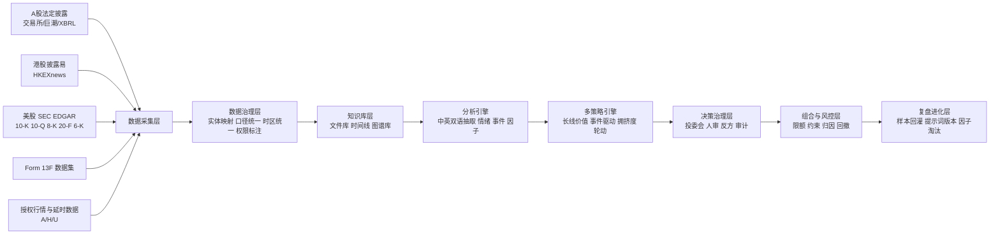
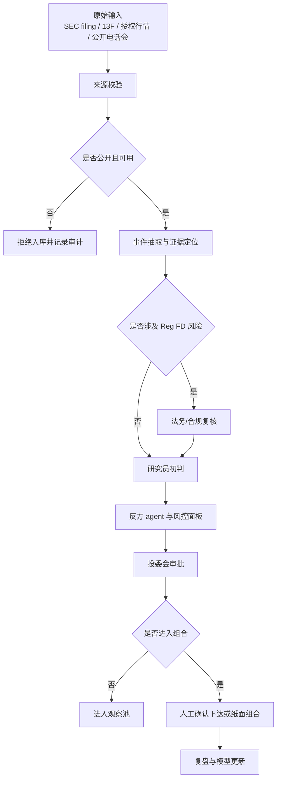

# AI Native 虚拟量化基金组织设计研究美股增补

## 执行摘要

将原方案从 A 股与港股扩展到美股后，组织设计应由 **A/H 双市场投研系统** 升级为 **A/H/U 三市场证据驱动型投研系统**。从公开信息基础设施看，美股的可研究性实际上更强：SEC 的 EDGAR 公司页面可直接聚合 10-K、10-Q、8-K、Proxy 等核心文件，EDGAR 全文检索覆盖自 2001 年以来的电子申报；同时，SEC 已对 10-K、10-Q、8-K、20-F、40-F 的封面信息实施 Inline XBRL 要求，这使美股在中低频基本面、事件驱动与披露文本分析方面，天然适合纳入 AI Native 投研流水线。 citeturn44search0turn44search4turn44search1

对 CEO 来说，新增美股并不意味着把原架构推倒重来，而是把原来以“中文公告 + A/H 法定披露 + 授权行情”为主的能力，升级为“**中英双语披露解析 + 三市场实体映射 + 多时区事件调度 + 分层数据授权**”。其中最重要的不是模型能力，而是数据边界：美股的法定披露可通过 SEC 获取，但实时市场数据与非展示用途通常存在单独许可与申报要求；Nasdaq 对 Non-Display 定义为机器或自动化设备在无人类显示场景下访问和使用数据，NYSE 也对 Non-Display Use 设有分类、声明与许可要求。因此，美股扩展版 MVP 仍应坚持“**公开披露 + 延时或日频行情 + 授权数据 + 人工审批执行**”的路线，而不是在未完成许可核验前直接接入实时自动交易链路。 citeturn45search0turn45search1turn45search6turn45search10

从研究方法看，美股会显著增强三类 Alpha 来源：其一是**披露事件型 Alpha**，因为 8-K、Proxy、业绩指引、资本分配、管理层变更等事件更加结构化；其二是**机构持仓拥挤度 Alpha**，因为 SEC 提供 Form 13F 数据集；其三是**英文文本情绪与措辞变化 Alpha**，因为 10-K、10-Q、20-F 与业绩电话会文本更易形成英文 NLP 基准。与此同时，新增美股也会带来新的治理要求，包括 Reg FD 的公平披露边界、英文文本抽取的可解释性、跨市场主数据映射的稳定性，以及多市场数据许可的成本控制。 citeturn44search2turn44search3turn44search15turn30search0turn30search2

公开规则也意味着：如果你的系统覆盖在美上市的中概股、港股双重上市公司或 ADR，那么**20-F 与 6-K** 必须进入核心证据链。SEC 明确，Form 20-F 是外国私人发行人的核心年度披露文件，Form 6-K 用于依规则提交阶段性报告；这使三市场知识图谱不再只是 “A/H 对照”，而应升级为 “A/H/U 发行主体—证券—披露—事件” 四层映射。 citeturn46search0turn46search1turn46search14

## 投资框架中的美股扩展

将美股纳入后，原报告中的投资框架不应改成“全球混合池一把抓”，而应改成“**同一哲学、分市场实现、统一投委会治理**”。也就是说，投资哲学仍然是：只使用可复核的公开信息、授权数据与可追溯模型输出构建证据链；但在执行层面，A 股、港股与美股分别设立市场特有的因子、事件模板与研判节奏，最后在组合层再做跨市场资本配置与风险对冲。这样做既能保留统一的 CEO 治理逻辑，也能避免把本来不同的披露制度和市场微结构硬塞进同一套评分器。SEC 的 EDGAR 体系、公众可检索的 10-K/10-Q/8-K，以及外国私人发行人的 20-F/6-K 机制，为这种“统一治理、分市场执行”的框架提供了可操作基础。 citeturn44search0turn44search4turn46search0turn46search1

美股扩展后，建议把原有的宏观—中观—微观框架补成 **宏观—行业—公司—交易结构** 四层。宏观层加入美元流动性、利率路径、美国就业与通胀叙事；行业层加入美国科技、医疗、消费、半导体等赛道的监管与资本开支周期；公司层重点读取 10-K、10-Q、8-K、Proxy、20-F、6-K；交易结构层则引入 13F 拥挤度、回购/增发、管理层变动、业绩指引调整与英文文本情绪变化。对中低频系统而言，这一层并非高频交易替代品，而是帮助 CEO 判断“预期差来自哪里、可持续多久、是否已被机构持仓反映”。 citeturn44search0turn44search2turn44search3turn44search15turn46search14

从 Alpha 分类看，美股最值得新增的不是“更快的 K 线”，而是“**更密集、更标准化的披露事件信号**”。其中长线更适合使用 10-K/10-Q/20-F 中的经营质量、现金流质量、资本配置、股权激励稀释、分部收入与管理层长期展望；短线更适合使用 8-K、6-K、业绩指引、电话会措辞变化、13F 抱团与挤兑线索。13F 数据集的公开可得性，使机构持仓拥挤度可以进入三市场统一风险面板；而英文金融情绪词典可为业绩说明、风险因素与管理层讨论提供标准化的情绪、约束、诉讼与不确定性标签。 citeturn44search3turn44search11turn30search0turn30search2

### 三市场 Alpha 来源补充表

| Alpha 维度 | A 股与港股原方案 | 加入美股后的新增信号 | CEO 级处理建议 |
|---|---|---|---|
| 基本面质量 | 财报、公告、行业景气、估值 | 10-K/10-Q/20-F 中 MD&A、分部披露、回购与股权激励稀释 | 保持长期核心权重，统一到“经营质量因子簇” |
| 事件驱动 | 公告、问询、政策、港交所披露 | 8-K、6-K、业绩指引、管理层变更、重大协议 | 设独立事件团队与事件 agent，不与长线评分混用 |
| 机构行为 | 北向/南向、基金季报、回购等 | 13F 持仓拥挤度、集中度变化、热门机构共识 | 作为风控与反身性监控，而非单独买入理由 |
| 文本情绪 | 中文公告、研报、舆情 | 英文 10-K/10-Q/电话会文本情绪、不确定性、诉讼词汇 | 建双语情绪模型，严禁中英文词典混用不校准 |
| 跨市场映射 | A/H 同主体估值比较 | ADR/在美上市中概股的 20-F/6-K 与港股/A 股联动 | 升级为 A/H/U 实体图谱与相对估值模块 |

上表中的信息源差异主要来自 SEC 披露体系、13F 数据集、以及英文金融文本资源；其中 10-K、10-Q、8-K 与 20-F/6-K 是结构化证据主源，13F 是机构持仓主源，英文文本情绪建议使用可授权商业词典或自建双语金融词表。 citeturn44search0turn44search3turn46search0turn46search1turn30search0turn30search2

### 长线与短线评分的美股增补口径

| 评分维度 | 长线评分增补项 | 短线评分增补项 | 备注 |
|---|---|---|---|
| 披露质量 | 10-K/20-F 风险因素稳定性、会计政策、审计意见、分部透明度 | 8-K/6-K 事件新颖度、事件严重性、市场预期差 | 同一事件不得同时重复计入长线与短线 |
| 资本配置 | 回购、股本稀释、并购整合、资本开支效率 | 回购授权公告、增发预期、可转债/融资事件 | 长线更关注累计效果，短线更关注触发点 |
| 机构行为 | 核心基金长期持有比例、13F 稳定度 | 13F 拥挤度上升过快、抱团瓦解 | 13F 有时滞，只用于中低频，不用于即时交易 |
| 文本情绪 | MD&A 语气一致性、风险披露扩张 | 电话会突发负面措辞、指引偏离 | 必须保留原文定位与模型置信度 |

这张评分表与原报告的逻辑保持一致，但把美股的“8-K/13F/英文披露”明确纳入证据链。SEC 的 13F 数据是从 XML 提交中抽取出的公开数据集；Reg FD 则要求对选择性披露的重大非公开信息进行公开披露，因此合法的美股研究系统应把“公开披露时点”作为事件时间基准，而不是依赖不可复核的私下渠道。 citeturn44search3turn44search15turn44search2turn44search14

### 本章可执行清单

| 行动项 | 优先级 | 负责人角色 | 估计时间 | 里程碑 |
|---|---|---|---|---|
| 将投资框架从 A/H 两市场改写为 A/H/U 三市场统一投哲、分市场执行 | 高 | CEO、投研负责人 | 1 周 | 发布新版《投资哲学与研究边界》 |
| 为美股建立单独的 10-K/10-Q/8-K/13F/20-F/6-K 证据模板 | 高 | 行业研究 Lead、数据负责人 | 2 周 | 样板库上线 |
| 重写长线/短线评分器，使美股事件与机构拥挤度进入评分但不穿透到未经审批的交易执行 | 高 | 量化负责人、风控负责人 | 2–3 周 | 新评分卡在回测与纸面组合中运行 |
| 设置“外国私人发行人”专门队列，单独处理 20-F/6-K 与港股联动逻辑 | 中 | 海外研究员、知识图谱负责人 | 2 周 | 中概/ADR 名单与映射规则完成 |

## 系统架构中的美股扩展

加入美股后，原来的八层架构仍然成立，但每一层都需要增加 **美股专属数据接口、英文 NLP 处理、三市场主数据映射、以及多时区任务调度**。最先要改的是数据采集层：A/H 模式下，系统主要抓取交易所公告、XBRL、历史行情与授权研报；扩展到美股后，必须新增 EDGAR Entity Landing Page、EDGAR Full Text Search、Inline XBRL 解析、Form 13F 数据集，以及实时/延时/日频市场数据的授权分流。SEC 已经提供公司维度的 filings 聚合与全文检索能力，能够显著降低公开披露接入成本。 citeturn44search0turn44search4turn44search1turn44search3

数据治理层要新增的，不是简单的英文化字段，而是 **会计口径与披露口径的双重映射**。A 股与港股体系下，你更常处理中国会计准则、港股公告格式与中文术语；美股后，你必须至少处理 U.S. GAAP / IFRS、SEC 表单体系、外国私人发行人与美国本土发行人的差异，以及公司主键从“股票代码”扩展为“Ticker + CIK + 发行主体 + 上市地点”。如果这一层不先统一，后面的知识库、agent 检索、策略回测和复盘归因都会被“同名不同主体”或“同主体多证券代码”污染。SEC 对 20-F 和 6-K 的形式要求，也说明外国私人发行人必须在主数据层拥有独立标识。 citeturn46search0turn46search1turn46search14

知识库层建议从原来的“A/H 公司知识库”升级为“**A/H/U 发行主体知识图谱 + 文件知识库 + 时间线知识库**”。文件知识库保存 10-K、10-Q、8-K、20-F、6-K、Proxy、年报与交易所公告的切片与定位；时间线知识库保存“披露时间—事件类型—影响层级—引用原文—后验表现”；发行主体知识图谱保存公司、子公司、品牌、业务分部、上市地、证券代码与历史更名。这一点对于跨境中概股尤为关键，因为同一主体可能同时出现在港股公告、SEC 20-F、以及美股 6-K 的不同语种文件中。 citeturn44search0turn46search0turn46search1

分析引擎层要新增英文文本解析能力。原方案中中文公告抽取与中文财务术语 benchmark 仍然保留，但美股增补版必须加入英文财务术语识别、风险因素变化检测、电话会措辞变化与指引修正抽取。对于英语情绪，建议把词典法作为基线，把嵌入与 reranker 作为增强，而不是直接让 LLM 裸奔做“情绪猜测”；原因是英文金融词典本身已有明确的商业许可边界，且类别体系可以直接转为 benchmark 标签。 citeturn30search0turn30search2

多策略引擎层对美股最有价值的新增策略，不是分钟级择时，而是 **披露事件流水线** 和 **机构拥挤度流水线**。前者以 8-K/6-K/10-Q/电话会摘要为触发器，后者以 13F 为持仓共识与反身性风险源。由于 13F 数据集是从 XML 提交扁平化抽取得到的公开结果，它更适合进入中低频轮动、拥挤度监控、候选池优先级，而不适合进入日内交易逻辑。 citeturn44search3turn44search15

### 三市场数据流增补图

这张图的“美股增补”核心并不在底层 DAG 数量，而在于新增了 SEC 披露与 13F，且要求治理层显式记录市场、时区、许可与主体映射。SEC 的公开检索能力，使文件采集成本下降；但市场数据仍要遵守 Non-Display 和订阅政策，因此图中“授权行情与延时数据”必须独立于法定披露通道。 citeturn44search0turn44search4turn44search3turn45search0turn45search1

### 美股扩展后的数据源与许可清单

| 模块 | 推荐主源 | 用途 | 接入原则 |
|---|---|---|---|
| 公司法定披露 | SEC EDGAR browse / search | 10-K、10-Q、8-K、Proxy、20-F、6-K 检索与下载 | 公开可采，保留 filing 元数据 |
| 结构化财务 | Inline XBRL / XBRL Viewer | 封面字段、财报标签、字段校验 | 用作结构化抽取和证据定位 |
| 机构持仓 | Form 13F data sets | 持仓拥挤度、共识与反身性风险 | 只用于中低频 |
| 行情 | 延时/EOD 或授权供应商 | 回测、横截面筛选、组合估值 | MVP 不接未经许可的实时 non-display |
| 电话会/转录 | 公司官网 webcast、授权供应商 | 事件复盘与情绪增强 | 必须核验版权与缓存权限 |

其中前四类的公开或许可边界有明确来源：SEC filings 和 13F 数据集公开可用；XBRL/Inline XBRL 可用于结构化解析；实时或非展示行情则受 Nasdaq、NYSE 的 Non-Display 政策约束。第五类电话会文本在版权上更复杂，因此在制度上应一律视为“需授权或仅内部缓存”的高敏感源。 citeturn44search0turn44search1turn44search3turn45search0turn45search1turn45search9

### 美股扩展后的模块接口建议

| 层级 | 新增接口 | 输入 | 输出 | 关键控制 |
|---|---|---|---|---|
| 数据采集 | `sec_filing_ingest` | CIK / ticker / filing type / date | filing 原文、元数据、附件 | 采集频率、来源白名单 |
| 数据治理 | `sec_entity_resolve` | ticker、公司名、CIK、上市地 | 主体唯一键、市场标签 | 重名冲突、历史更名 |
| 知识库 | `filing_chunk_store` | filing 文本、章节、页面定位 | chunk、embedding、证据索引 | 原文定位不可丢失 |
| 分析引擎 | `us_event_extract` | 8-K/6-K/电话会摘要 | 事件标签、置信度、证据片段 | 提示词版本与评测集 |
| 策略引擎 | `crowding_score_update` | 13F 扁平数据、行业标签 | 拥挤度得分、候选池优先级 | 滞后期标签 |
| 决策治理 | `regfd_compliance_gate` | 事件、来源、发布时间 | 是否可入库/可讨论/可执行 | 公平披露审查 |
| 风控 | `tri_market_limit_check` | 市场权重、币种、行业暴露 | 限额结果、拦截原因 | 市场与币种双限额 |
| 复盘进化 | `prompt_eval_pipeline` | 输出样本、标注、版本 | 通过/回滚/再训练 | 审计日志与版本冻结 |

这组接口是对原八层架构的增补，不改变总结构，但把 SEC、13F、Reg FD 和三市场主数据治理显式化。对于编排、特征一致性、检索与 agent 协作，仍然建议沿用原方案中的 Airflow/Dagster、Feast、Qdrant/Elastic、LangGraph/Qwen-Agent、MLflow、OpenLineage 和 OpenTelemetry 组合。Airflow 适合 author/schedule/monitor 工作流，Dagster 强于可声明的数据资产；Feast 解决训练/服务一致性；Qdrant 与 Elastic 都支持向量检索与过滤；LangGraph 支持 durable execution 和 human-in-the-loop；MLflow、OpenLineage、OpenTelemetry 分别覆盖模型版本、数据血缘与可观测性。 citeturn23view0turn23view1turn23view2turn23view3turn38view2turn23view7turn23view4turn23view5turn23view6

### 本章可执行清单

| 行动项 | 优先级 | 负责人角色 | 估计时间 | 里程碑 |
|---|---|---|---|---|
| 新增 SEC EDGAR、13F 与美股授权行情接入 | 高 | 数据平台主管 | 2–3 周 | 美股 ingestion DAG 上线 |
| 建立三市场主体唯一键与 A/H/U 映射表 | 高 | 数据治理负责人 | 2 周 | 主数据字典发布 |
| 增加英文披露抽取、事件分类与情绪基线 | 高 | NLP 负责人 | 3–4 周 | 英文 benchmark 首版 |
| 将 13F 拥挤度纳入风控与候选池排序 | 中 | 量化研究负责人 | 2 周 | 拥挤度面板上线 |
| 对 market data、transcript、research 数据源增加许可标签 | 高 | 合规负责人、平台工程师 | 1 周 | 权限元数据表启用 |

## 交互与治理中的美股扩展

美股扩展后，CEO Dashboard 至少应新增三块内容：**SEC 时间线、8-K 事件墙、13F 拥挤度热图**。SEC 时间线展示同一主体最近的 10-K、10-Q、8-K、20-F、6-K 与 Proxy；8-K 事件墙按重大性和主题分层显示；13F 热图显示行业与主体层面的机构共识变化。这样做的意义并不只是让页面“更国际化”，而是让 CEO 在同一仪表盘上看到“基本面更新、事件触发、机构反身性”三条主线是否共振。 citeturn44search0turn44search3turn46search14

公司页也应改成“三市场主体页”，而不是“单股票页”。一个主体页应能并列展示：A 股公告、港股公告、SEC 披露、关键财务表、最新事件、证据链、投委历史、对手方关系、跨市场估值与持仓限制。对于外国私人发行人，还应单独显示“最近 20-F / 最近 6-K / 是否同时在港上市 / 是否为 ADR 或中概”这些字段，以防研究员把 6-K 当作 8-K、或把 20-F 的信息刷新节奏误判成美国本土发行人那一套。 citeturn46search0turn46search1turn46search14

自然语言交互层要新增“英文原文优先、中文摘要跟随”的回答链路。对美股问答，agent 应先检索原始 filing 或其官方附件，再生成中文摘要；页面上必须同时展示原文定位、提取字段、摘要版本、模型版本和提示词版本。这样做既是为了提高可解释性，也是为了降低英文抽取的幻觉风险。MLflow Prompt Registry 已经提供 prompt 的版本化、跟踪与复用能力，可直接承担“提示词审批—回滚—审计”的治理底座。 citeturn43search0turn43search2turn43search10

治理层面对美股最关键的新增约束有两个。第一个是 **Reg FD 闸门**：只允许基于公开披露、公开电话会、公开新闻稿与授权数据生成结论，严禁将疑似选择性披露、单独路演纪要、未经确认的私聊纪要直接写入可执行建议。SEC 对 Reg FD 的核心要求是，当发行人向特定对象选择性披露重大非公开信息时，必须对公众进行公开披露。第二个是 **Non-Display 数据闸门**：任何用于机器检索、打分、回测或自动化路由的实时行情，都必须先完成是否属于 non-display、是否需要 declaration 与何种许可类别的审查。 citeturn44search2turn44search14turn45search0turn45search1turn45search6

权限与审计日志也要同步扩展。对于美股模块，建议记录至少六项审计字段：事件类型、来源系统、发布时间、是否 Reg FD 公开源、是否实时 non-display 数据、是否存在人工覆核。最小权限原则依然适用；NIST 将 least privilege 定义为只授予完成任务所必需的最小访问权限，而审计记录则至少要包含事件类型、时间、地点/系统、来源、结果与主体标识。这个标准非常适合直接映射到 agent 工具权限与投研系统日志字段。 citeturn16search0turn16search21turn16search22

### 美股版投委会合规流程图

这套流程的关键不是把所有美股信号都放慢，而是把“可研究”与“可执行”分开：公开源可以研究，但是否执行还要穿过 Reg FD、数据许可、风控与投委会四道门。 citeturn44search2turn45search1turn16search22

### 本章可执行清单

| 行动项 | 优先级 | 负责人角色 | 估计时间 | 里程碑 |
|---|---|---|---|---|
| 在 CEO Dashboard 新增 SEC 时间线、8-K 事件墙、13F 热图 | 高 | 产品负责人 | 2 周 | CEO 页面新版发布 |
| 在公司页显示 20-F/6-K 与 A/H/U 主体联动信息 | 高 | 前端负责人、知识图谱负责人 | 2 周 | 三市场主体页上线 |
| 建立 Reg FD 与 Non-Display 双闸门 | 高 | 合规负责人、后端负责人 | 1–2 周 | 合规拦截规则启用 |
| 将 prompt 版本、证据定位与输出摘要写入审计日志 | 中 | 平台工程负责人 | 2 周 | 审计日志字段扩展完成 |

## 落地调整与里程碑

把美股纳入后，原来的 MVP 路线不需要重写，但建议重新排序。**第一阶段只做公开 SEC 披露与延时/日频行情；第二阶段再引入 13F、英文情绪与授权电话会文本；第三阶段才做 A/H/U 相对价值、跨市场联动与半自动化组合管理**。这个顺序的逻辑是：先享受 SEC 披露与 EDGAR 检索带来的研究效率红利，再逐步进入许可更复杂、治理更严格的实时与非展示数据。 citeturn44search0turn44search4turn45search0turn45search1

公开案例也支持这种“先研究、后策略、再服务化”的路线。基金行业获奖案例已经展示，LLM、量化引擎和本地化知识库结合后，可以系统性提升研报处理、观点生成、资产配置与策略服务效率；但它同样强调底层指标库、异构算力、日志中心与多端服务，而不是把系统起点设成“直接自动交易”。对于 3–8 人初创团队来说，美股扩展更应以“研究覆盖面扩大”和“证据链质量提升”为第一目标，而不是以“交易速度提升”为目标。 citeturn24view0

### 美股并入后的三阶段增补计划

| 阶段 | 功能范围 | 资源估算 | 关键里程碑 | 主要风险 | 缓解措施 |
|---|---|---|---|---|---|
| 阶段一 | 接入 SEC EDGAR、10-K/10-Q/8-K、20-F/6-K、延时或日频行情；上线英文 filing 摘要与事件时间线 | 2–3 名工程/数据，1 名研究员 | 美股主体页与基础问答可用 | 英文抽取误差高 | 先做 rule-based + 人审基线 |
| 阶段二 | 新增 13F 拥挤度、英文情绪、授权电话会摘要；接入三市场主数据映射 | 3–5 人 | 三市场研究看板稳定运行 | 数据许可和版权复杂 | 强制标签化数据权限，先白名单源 |
| 阶段三 | 做 A/H/U 相对价值、跨市场风控、组合层归因与半自动化审批流 | 5–8 人 | 三市场投委会闭环成型 | 非展示数据与执行链合规压力 | 保持人工下达、单独法律审查 |

上表中的阶段边界，主要受 SEC 披露的易得性和 Nasdaq/NYSE 数据许可复杂度共同决定。换言之，美股很好加，但“**好加的是公开披露，不是实时自动化数据链**”。 citeturn44search0turn44search3turn45search0turn45search1turn45search9

### 对原研究计划的升级建议

| 原研究项 | 原范围 | 升级后范围 |
|---|---|---|
| 数据授权矩阵 | A/H | A/H/U，新增 SEC、Nasdaq、NYSE、转录稿供应商 |
| 中文术语 benchmark | 中文公告财务术语 | 中英双语披露 benchmark，区分 CN/EN/双语翻译链 |
| A/H 知识图谱 | A/H | A/H/U 发行主体图谱，新增 CIK 与外国私人发行人规则 |
| 反方自动化 | A/H 证据反驳 | 增加 8-K 负面事件、Reg FD 边界、13F 抱团瓦解反方库 |
| 事故剧本 | A/H 数据与 agent 事故 | 新增 SEC 采集异常、英文抽取幻觉、non-display 误用事故 |

### CEO 需要立即拍板的决策

| 决策项 | 建议结论 |
|---|---|
| 美股是不是和 A/H 一起立项 | 是，但必须作为“三市场架构中的独立市场模块”立项 |
| 美股先做什么 | 先做 SEC 披露与延时/日频数据，不先做实时 non-display |
| 电话会文本是否立即接入 | 仅接公司公开 webcast 与已授权来源 |
| 中概/ADR 是否优先 | 是，优先级高于纯美股本土小票，因为更容易形成 A/H/U 联动价值 |
| 是否把 13F 直接做成选股主因子 | 否，13F 更适合做拥挤度与反身性风控 |
| 是否允许 agent 直接基于美股事件自动下单 | MVP 阶段不允许，必须人工审批 |

### 开放问题与限制

本增补聚焦**美股公开披露、授权数据、三市场架构与治理设计**，未展开美国税务、券商接入、投资顾问牌照、客户资金募集、以及美股衍生品交易规则等更高合规门槛事项；如果未来从“研究辅助系统”升级为“对外资产管理或自动执行平台”，需要单独补充美国与中国内地/香港三地的法律合规专题。SEC、Nasdaq、NYSE 已明确公开披露与市场数据许可边界，但电话会转录、卖方研报二次使用、以及多供应商混合缓存策略，仍然需要逐一核验合同条款，而不能只依赖工程惯例。 citeturn44search2turn45search1turn45search9turn34search2