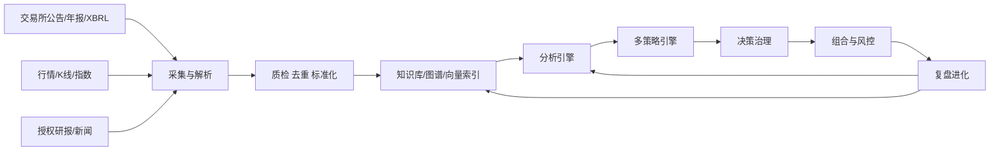
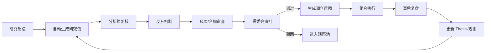

# AI Native 虚拟量化基金组织设计研究

> 状态说明：本文是历史研究底稿，保留原始论证和引用脉络。当前执行口径已调整为“不采购或依赖商业授权数据”，以 `tasks/todo.md`、`docs/product-requirements-document.md`、`docs/api-contracts.md` 和代码中的 `public_*` / `local_reference_*` source governance 为准。

## 执行摘要

从 CEO 视角判断，这个方案**可行，但必须限定为“研究增强 + 决策治理 + 半自动执行”的 AI Native 组织**，而不是一开始就做成“完全自治、黑箱下单”的自动基金。原因很清楚：一方面，A 股与港股的公开披露、年报、中报、临时公告、历史文件与部分结构化财务数据已经足以支撑中低频、基本面为主的投研流程化；A 股信息披露必须同时向所有投资者公开披露，法定披露文件需在交易所网站及规定媒体披露，港交所披露易可检索自 1999 年 4 月 1 日起的上市公司公告与年报；上交所也已将 XBRL 深度用于上市公司和基金信息披露。另一方面，监管与行业标准已经把 AI 在资管里的边界说得很清楚：中基协 2026 年发布的大模型技术应用规范给出了基础设施、数据管理、模型服务、应用技术、安全管理、场景应用六层参考框架；证监会对程序化交易实行“先报告、后交易”、实时监控和差异化高频监管；生成式 AI 服务、数据安全、个人信息保护与版权使用也都已有明确制度边界。换句话说，**能落地的不是“万能 AI 基金”，而是“有证据链、有权限边界、有人工拍板、有审计日志”的虚拟量化基金组织”。** citeturn24view0turn25view0turn22search3turn39view1turn19view0turn21view1turn42search2turn43search4turn42search1turn42search3

为什么现在值得做。第一，公开数据的可得性已经足够支持中低频投研：上市公司定期报告本身就要求披露主要财务指标、管理层讨论与分析、重大事项、风险因素以及与行业有关的信息；港交所披露易和上交所/深交所体系为 A/H 双市场提供了基础信息底座。第二，模型与工程栈已经成熟到可支撑长文本、工具调用和多 agent 协作：Qwen 长上下文与函数调用文档已给出可直接落地的能力路径，LangGraph 提供 durable execution 与 human-in-the-loop，Feast 可缓解 training-serving skew，Qdrant 支持向量检索与元数据联合过滤，OpenLineage 和 OpenTelemetry 则把数据谱系、日志、指标、链路串起来。第三，行业已经开始出现“数据 + 大模型 + 量化引擎”的实战样板。中基协披露的获奖案例中，富国基金一项指数投资决策系统公开介绍其以大语言模型、量化计算引擎和 1200+ 指标体系进行投研支持，并声称研报处理效率提升 90%；这至少说明**“AI 辅助投研平台”在基金行业不是概念验证，而是进入工程化期**，即便这些效率数字属于机构自报，也足以证明方向可落地。 citeturn24view0turn22search3turn12search0turn12search1turn9search12turn8search8turn8search17turn9search7turn30search11turn33search3

本报告的核心建议是：把“虚拟量化基金组织”设计成一个由**八层系统、六类核心 agent、三道治理关口、两套投资节奏**构成的 AI Native operating model。八层系统分别负责数据采集、数据治理、知识库、分析引擎、多策略引擎、决策治理、组合与风控、复盘进化；六类核心 agent 对应 CEO/CIO、宏观、行业、公司、风险合规、复盘进化等部门；三道治理关口是“事实核验—反方挑战—人工拍板”；两套投资节奏则强制区分长线价值组合与短线热点跟踪。**如果不做长短线分仓、不做证据链版本化、不做反方机制和权限审计，这个组织最多只是一个聊天机器人，不是基金操作系统。**这一设计是在中基协六层参考框架、金融 AI 评价标准、可解释性治理讨论以及现代组合管理方法基础上的扩展性方案。 citeturn20view1turn34search2turn33search1turn28search1turn29search2turn11search1

从落地顺序看，CEO 最该做的不是先选“最强模型”，而是先做四个硬决策：**先决定投资边界，再决定数据边界，再决定权责边界，最后才决定模型边界。**也就是说，先明确只做 A/H、中低频、研究增强；再明确公开披露数据 + 合规采购研报；再明确“AI 不能独立完成建仓/清仓/加杠杆/突破限制”；最后才决定用什么 LLM、向量库、特征库和优化器。这样做，可以把技术不确定性压缩在系统内部，而把组织风险固定在董事会与投委会能理解、能追责的边界内。 citeturn21view1turn19view0turn33search1turn30search14turn30search1

| CEO 关键决策题 | 建议结论 | 原因 | 是否进入 MVP |
|---|---|---|---|
| 是否做完全自动下单 | 不建议 | 程序化交易与 AI 模型风险治理要求高，早期最容易在合规和误杀上出事故 | 否 |
| 是否做 A/H 双市场 | 建议 | 公开披露与行业研究覆盖足够，且用户设定已默认 A/H 场景 | 是 |
| 是否做秒级/高频 | 不建议 | 对个人/小团队不现实，且监管、基础设施、成本门槛高 | 否 |
| 是否使用券商研报 | 建议，但必须授权采购/许可接入 | 研报有价值，但版权与转载授权边界明确 | 是 |
| 是否采用多 agent | 建议 | 便于映射部门职责、分离研究与风险、保留审计线索 | 是 |
| 是否保留人工投委会 | 强制保留 | 决策责任、例外审批、事后追责都需要人类签字 | 是 |

上表是本报告的经营结论；其边界依据来自证监会程序化交易与信息披露规则、中基协大模型标准、港交所与交易所公开披露体系以及版权与数据法规。 citeturn21view1turn24view0turn20view1turn22search3turn40search4turn42search2turn43search4turn42search1

## 研究边界与 CEO 决策基线

### 组织定位

本文所说的“AI Native 虚拟量化基金组织”，不是法律意义上的基金管理人替代品，而是一个**面向 A 股与港股、中低频、公开信息驱动**的投研与组合管理操作系统。它把传统基金公司的数据、研究、策略、风控、投委会、复盘六大条线，映射为一套 agent + skill + workflow 的数字组织，并要求所有机器输出都可追溯到数据来源、提示词版本、模型版本、人工确认记录和最终交易意图。这个定位，与中基协大模型技术应用规范中“投资研究、合规风控、市场营销、客户服务、运营管理、效率办公、研发编程”等场景划分一致，但本文进一步把“决策治理、组合管理、复盘进化”单独拉出来，作为 CEO 必须单独拥有的治理层。 citeturn20view1turn19view0

在数据底座上，首选**交易所与法定披露口径的原始文件**。A 股侧，上市公司及相关信息披露义务人必须同时向所有投资者披露重大信息，不得提前泄露；依法披露的信息应在证券交易所网站和规定媒体发布。港股侧，披露易提供上市公司公告、通函、年报等检索，官方说明可追溯至 1999 年 4 月 1 日起的文件。上交所已将 XBRL 作为上市公司与基金信息披露监管工具；巨潮/深证信体系也已提供数据服务平台。这意味着，中低频投研的不少“原材料”并不稀缺，关键瓶颈不在拿数据，而在**结构化、归因、假设管理和治理闭环**。 citeturn24view0turn25view0turn22search3turn39view1turn2search10

### 部门到 agent 的映射

| 组织单元 | 核心 agent | 主要 skill | 关键产出 | 最终责任人 |
|---|---|---|---|---|
| CEO 办公室 | CEO Copilot | 全局摘要、风险热图、例外事项升级、资源调度 | 周经营简报、例外审批单 | CEO |
| CIO / 投研中台 | CIO Agent | 投资框架编排、投委会 Pack 汇总、权重协调 | 投委会议程、决策包 | CIO |
| 宏观研究部 | Macro Agent | 流动性、政策、利率、汇率、商品、风格判断 | 宏观 regime 标签 | 宏观负责人 |
| 行业研究部 | Industry Agent | 产业链图谱、景气跟踪、份额变化、政策影响 | 行业景气分、产业链地图 | 行业负责人 |
| 公司研究部 | Company Agent | 年报解析、财务质量、竞争优势、事件跟踪 | 公司研究卡、估值与假设表 | 首席分析师 |
| 风险合规部 | Risk & Compliance Agent | 限额、黑白名单、版权、日志、异常行为监测 | 风险意见、拒绝/放行记录 | CRO/合规负责人 |
| 组合管理部 | PM Agent | 组合优化、再平衡、仓位与暴露管理 | 组合建议、调仓单 | PM |
| 复盘与进化部 | Review Agent | 归因、误差分解、AB 测试、模型评分 | 复盘报告、挑战者模型结论 | 研究平台负责人 |

这个表不是“给每个岗位配一个聊天窗口”，而是把部门职责转成**独立可测试、可部署、可审计的 agent 单元**。这与 AutoGen 关于 agent 可独立开发、测试、部署的说明一致，也与 LangGraph 强调的 durable execution、human-in-the-loop 和状态化记忆能力相匹配；同时，若采用中文模型栈，Qwen-Agent 已明确把工具使用、规划与记忆作为其核心能力。由于 AutoGen 官方仓库已标注 maintenance mode，生产环境应优先选择持续演进、治理能力更强的编排框架。 citeturn9search9turn9search12turn12search13turn9search17

### CEO 决策基线

对 CEO 来说，本组织必须遵守五条“先验宪法”。

第一，**公告优先于新闻，原文优先于二手摘要，交易所口径优先于资讯转载**。上市公司不得以新闻发布或答记者问替代公告义务，这意味着所有 agent 的事实层都应优先引用公告、年报、招股书、交易所问询回复、公司业绩会纪要原文。第二，**研究先于交易**。程序化交易规则已经明确计算机程序自动生成或下达交易指令的活动属于程序化交易，相关活动受实时报送、监测和风险控制要求约束；因此 MVP 应定位为研究建议系统，而非自动交易系统。第三，**长期与短期必须制度分离**。长线价值与短线热点不仅信号不同，持有期限、风险承受、评价口径和复盘频率也不同。第四，**所有观点必须可证伪**。没有证伪条件的观点，只是叙事，不是投资假设。第五，**所有异常必须能追责**。最小权限、完整审计日志和例外审批不是 IT 细节，而是 CEO 对组织损失承担责任的前提。 citeturn25view1turn21view1turn30search2turn30search1turn30search0

### 本章可执行清单

| 行动项 | 优先级 | 负责人角色 | 估计时间 | 里程碑 |
|---|---|---|---|---|
| 明确目标市场、频率与投资边界 | 高 | CEO / CIO | 1 周 | 形成《组织边界说明书》 |
| 明确部门—agent 映射与签字责任 | 高 | CEO / HRBP / 平台负责人 | 1 周 | 发布 RACI 图 |
| 确定“公告优先、研究先行、人工拍板”的三原则 | 高 | CIO / CRO | 3 天 | 写入投委会章程 |
| 确定长线/短线双账户与双 KPI | 高 | CIO / PM | 1 周 | 建立双评分卡 |
| 明确禁止事项清单 | 高 | CRO / 合规 | 3 天 | 发布禁止自动执行清单 |

## 投资框架与方法论

### 投资哲学与 Alpha 来源

建议采用一套**“公开信息的慢变量优势 + 产业链结构化分析 + 严格组合纪律”**的投资哲学，而不是把希望押在速度优势上。现代组合理论为组合层的风险收益权衡提供了基础；Fama-French 与 Carhart 等经典研究证明，价值、规模、动量等公共因子能够解释相当部分收益差异；Jegadeesh-Titman 的动量研究则说明“买强卖弱”的行为特征在统计上可形成可交易信号。把这些经典方法搬到 A/H 与中低频现实里，最合理的做法不是复刻学术模型，而是把它们变成一个**Alpha 来源分类器**，用于组织资源配置。 citeturn28search1turn28search2turn28search3

下表不是“市场真理”，而是**AI Native 组织在 A/H 中低频场景下的建议起步权重**。理论依据来自价值、动量、组合优化与结构化研究范式；具体权重是本文结合公开披露可得性、个人/小团队算力现实与 A/H 场景可执行性做出的经营推论。 citeturn28search1turn28search2turn28search3turn29search2turn11search1

| Alpha 来源 | 定义 | 建议起步权重 | 典型 holding period | 主要 agent |
|---|---|---:|---|---|
| 基本面与估值 | 利润、现金流、资本开支、估值错配、利润质量 | 30% | 3-18 个月 | Company Agent |
| 产业链与景气 | 供需、价格、库存、产能、份额迁移 | 20% | 1-9 个月 | Industry Agent |
| 事件与预期差 | 财报、指引、政策、问询回复、并购、回购 | 15% | 1 周-6 个月 | Company + CIO Agent |
| 趋势与动量 | 相对强弱、行业轮动、价格延续性 | 15% | 2 周-6 个月 | PM Agent |
| 情绪与资金流 | 新闻、舆情、龙虎榜/资金偏好、主题热度 | 10% | 1 天-8 周 | Macro/Industry Agent |
| 风险对冲与风格漂移 | beta、行业暴露、风格因子偏离 | 5% | 持续 | Risk Agent |
| 特殊情形 | 分红、回购、可转债、事件驱动重估 | 5% | 1 周-12 个月 | CIO / PM |

### 宏观、中观、微观与情绪的统一框架

CEO 要求的不是“多看几个维度”，而是**把维度做成串联的工作流**。宏观层回答“市场此刻奖励什么”；中观层回答“哪些产业链位置最先受到驱动”；微观层回答“哪些公司在该链条中最值得持有”；情绪层回答“这些判断是否已被市场过度拥挤”。年度报告和中期报告法定要求披露主要财务指标、管理层讨论与分析、重大事件、风险因素和与行业有关的信息，因此公司文本分析不是锦上添花，而是基本功。对于中文长文档，长上下文模型和函数调用已经适合承担“先抽取、再比对、后建模”的工作；对于英文资料与跨市场资讯，FinBERT 和 Loughran-McDonald 等金融文本方法可作为情绪与措辞分析补充，但商业使用时要特别注意许可边界。 citeturn24view0turn12search0turn12search1turn35search8turn15search12turn16search3

| 维度 | 核心问题 | 数据输入 | 关键输出 | 常见误判 |
|---|---|---|---|---|
| 宏观 | 流动性、风险偏好、政策方向、风格切换 | 政策文件、利率、汇率、商品、指数风格 | Macro Regime 标签 | 把宏观叙事直接映射为个股机会 |
| 中观 | 行业景气与链条传导到哪里 | 行业公告、产销数据、价格、库存、公司口径 | 产业链热力图、份额迁移图 | 用单点价格替代全链景气 |
| 微观 | 公司能否兑现、是否被低估 | 年报、中报、临时公告、业绩会纪要、估值 | Thesis Card、反证条件 | 把管理层口径等同于事实 |
| 情绪/技术 | 市场是否拥挤、是否过热或出清 | 新闻、社媒、价格动量、成交结构 | Crowd Score、Timing Overlay | 把热度当作基本面 |

### 长线与短线的制度分离

长线组合的目标，是用更长持有期换更高的认知复利；短线组合的目标，则是用更严格仓位、回撤与止损纪律去捕捉预期差传播。二者**不应共用一个评分卡，也不应共用一个投委会议程**。从组织角度，这能避免短线热点稀释长线研究注意力，也能避免长线叙事掩盖短线交易错误。 citeturn28search2turn28search3turn21view1

建议把评分卡做成双轨：长线更看重商业质量、资本回报、估值与证据一致性；短线更看重催化剂、拥挤度、流动性、纪律约束和退出规则。下面的表是可直接在系统中配置的模板。  

| 维度 | 长线权重 | 短线权重 | 说明 |
|---|---:|---:|---|
| 商业质量 | 25 | 5 | 长线核心，短线仅作底线筛选 |
| 财务质量 | 20 | 5 | 现金流、利润质量、负债约束 |
| 估值与安全边际 | 20 | 5 | 长线必须有价格纪律 |
| 产业景气与份额 | 15 | 15 | 两条线都重要，但角度不同 |
| 催化剂明确度 | 5 | 25 | 短线核心：财报、政策、事件 |
| 趋势/动量 | 5 | 20 | 短线 timing 的关键变量 |
| 情绪与拥挤度 | 5 | 15 | 过热时减分，出清时加分 |
| 可交易性与流动性 | 5 | 10 | 短线更高权重 |

### 投资假设管理、证据链与评分体系

真正的“AI Native”不在于能自动生成一份研究报告，而在于**能否把一条投资假设拆成可审计的证据链**。建议每条 Thesis 至少包含七个字段：假设陈述、催化剂、证据清单、反证条件、仓位建议、风险暴露、失效日期。证据必须有来源等级和新鲜度分：交易所/公司披露最高，监管文件其次，授权券商研报作为外部观点，新闻与社媒只做辅助，不得单独触发重大仓位变更。证券研究报告行业规范要求研究报告发布遵循独立、客观、公平、审慎原则，并将研究制作发布与销售服务分开管理；这恰恰说明研报应该被系统当作**“高质量外部观点源”**，而不是事实源。 citeturn41search0turn41search2turn24view0turn25view0

建议采用“五因子证据评分法”：**来源可靠度、因果强度、一致性、可交易性、时效性**。每个证据项按 0-5 分打分，总分映射为 Thesis Confidence。一个简单但有效的规则是：  
- 只有当总分高、关键反证未触发、风险限额未超标时，系统才允许进入投委会候选；  
- 若来源只来自新闻/社媒而无公告佐证，则最高只能进入“观察池”；  
- 若证据之间明显冲突，必须触发 Red Team 复核。  
在工程上，这要求将数据谱系、模型版本、提示词、人工编辑痕迹全部留档；OpenLineage、MLflow 与 OpenTelemetry 正好分别覆盖了作业/数据谱系、模型/实验和日志/指标/链路三条线。 citeturn9search7turn7search3turn30search11turn30search3

### 示例输出样板

下面三个样板应直接内置到 MVP 中，作为所有 agent 输出的统一协议。

#### 公司研究报告模板

```text
标题：公司研究卡
公司：<名称/代码>
日期：<YYYY-MM-DD>
覆盖市场：A股 / 港股
结论：买入 / 观察 / 回避

一、核心结论
- 这是一笔什么钱
- 市场当前错在哪里
- 未来 1-4 个季度最关键变量

二、商业模式与竞争位置
- 产品/客户/渠道
- 护城河判断
- 行业链位置与份额变化

三、财务拆解
- 收入/利润/现金流
- ROE/ROIC/资本开支
- 资产负债质量与潜在雷点

四、估值与情景
- 当前估值
- 基准/乐观/悲观三情景
- 目标价区间与安全边际

五、催化剂与反证
- 催化剂清单
- 反证条件
- 失效日期

六、风险清单
- 经营风险
- 政策风险
- 交易与流动性风险

七、证据链摘要
- 公告 / 年报 / 监管文件 / 授权研报 / 其他
```

#### 投委会决策表

| 项目 | 内容 |
|---|---|
| 议题编号 | IC-YYYYMMDD-XX |
| 标的 | 公司 / 行业 / 主题 / 对冲 |
| 推荐动作 | 新建 / 加仓 / 减仓 / 清仓 / 观察 |
| 触发原因 | 财报 / 行业景气 / 政策 / 技术面 / 风险事件 |
| 核心证据 | 证据编号列表 |
| 反方意见 | Red Team 摘要 |
| 风险意见 | 合规/限额/相关性/拥挤度 |
| 决策结论 | 通过 / 有条件通过 / 驳回 |
| 条件 | 仓位上限、价格区间、止损/止盈 |
| 签字链 | 分析师 / 风险 / CIO / CEO 或投委会主席 |

#### 长短线评分表

| 因子 | 分数 | 权重 | 加权得分 | 备注 |
|---|---:|---:|---:|---|
| 商业质量 | 0-5 | 见双轨配置 | 自动计算 |  |
| 财务质量 | 0-5 | 见双轨配置 | 自动计算 |  |
| 估值/安全边际 | 0-5 | 见双轨配置 | 自动计算 |  |
| 景气/份额 | 0-5 | 见双轨配置 | 自动计算 |  |
| 催化剂 | 0-5 | 见双轨配置 | 自动计算 |  |
| 趋势/动量 | 0-5 | 见双轨配置 | 自动计算 |  |
| 情绪/拥挤度 | 0-5 | 见双轨配置 | 自动计算 |  |
| 交易性 | 0-5 | 见双轨配置 | 自动计算 |  |

### 本章可执行清单

| 行动项 | 优先级 | 负责人角色 | 估计时间 | 里程碑 |
|---|---|---|---|---|
| 固化 Alpha 分类与起步权重 | 高 | CIO / 研究负责人 | 1 周 | 发布《Alpha 字典》 |
| 配置长线/短线双评分卡 | 高 | CIO / PM / Risk | 1 周 | 系统中可打分 |
| 建立 Thesis Card 与反证字段 | 高 | 平台产品经理 / 分析师代表 | 1 周 | 形成统一 schema |
| 设定证据源等级与最低入池门槛 | 高 | CRO / 首席分析师 | 3 天 | 发布《证据分级表》 |
| 建立 Red Team 规则 | 中 | CIO / CRO | 1 周 | 每个议题都能触发反方机制 |

## 系统架构设计

### 从六层参考框架扩展到八层投资操作系统

中基协 2026 年大模型标准提出了六个核心部分：基础设施层、数据管理层、模型服务层、应用技术层、安全管理层和场景应用层。这个框架非常适合做行业共识底座，但从 CEO 经营视角仍然不够，因为它没有把“策略—治理—组合—复盘”拆成独立经营层。本文建议在该六层框架基础上扩展为**八层投资操作系统**：  
**数据采集、数据治理、知识库、分析引擎、多策略引擎、决策治理、组合与风控、复盘进化。**  
这样的切分方式，既保留了行业标准里的数据/模型/安全主线，又把基金组织最重要的“决策责任链”显性化。 citeturn20view1turn19view0

下图是在中基协参考框架、交易所披露规则和主流 AI/数据工程文档基础上的扩展设计。模块职责描述参考了 AMAC 六层框架、Airflow/Dagster/Prefect 的工作流能力、OpenLineage 的谱系模型、MLflow 的模型治理能力和 OpenTelemetry 的可观测性能力；层间边界与接口是本文推论。 citeturn20view1turn31search5turn31search8turn31search22turn9search7turn7search3turn30search11

```mermaid
flowchart TB
    subgraph A[复盘进化层]
        A1[归因分析]
        A2[回测与重放]
        A3[挑战者模型]
        A4[提示词/策略迭代]
    end

    subgraph B[组合与风控层]
        B1[仓位管理]
        B2[风险暴露]
        B3[限额/黑白名单]
        B4[组合优化]
    end

    subgraph C[决策治理层]
        C1[投委会 Pack]
        C2[反方机制]
        C3[人工审批]
        C4[审计日志]
    end

    subgraph D[多策略引擎层]
        D1[价值策略]
        D2[景气轮动]
        D3[事件驱动]
        D4[趋势/动量]
        D5[情绪覆盖]
    end

    subgraph E[分析引擎层]
        E1[宏观分析]
        E2[产业链分析]
        E3[公司解析]
        E4[估值/因子]
        E5[NLP/情绪]
    end

    subgraph F[知识库层]
        F1[公司知识图谱]
        F2[行业图谱]
        F3[Thesis 库]
        F4[证据链仓]
    end

    subgraph G[数据治理层]
        G1[标准化]
        G2[质检/去重]
        G3[标签/权限]
        G4[特征生产]
    end

    subgraph H[数据采集层]
        H1[交易所公告]
        H2[年报/中报/XBRL]
        H3[K线/成交/指数]
        H4[授权研报]
        H5[新闻/舆情]
    end

    H --> G --> F --> E --> D --> C --> B --> A
    A --> F
    B --> C
```



### 八层模块说明与接口

| 层级 | 核心目标 | 关键模块 | 主要输入 | 主要输出 |
|---|---|---|---|---|
| 数据采集 | 合规获取原始材料 | 抓取器、订阅器、文件解析 | 公告、年报、K 线、研报、新闻 | Raw Event |
| 数据治理 | 变成可信数据资产 | 质检、去重、标准化、标签、特征生产 | Raw Event | Clean Dataset / Feature |
| 知识库 | 沉淀关系和历史上下文 | 图谱、向量索引、Thesis 仓、证据仓 | Clean Dataset | Knowledge Object |
| 分析引擎 | 形成解释性分析 | 宏观、行业、公司、NLP、估值、因子 | Knowledge Object | Analysis Note / Signal Component |
| 多策略引擎 | 组合分析结果为策略观点 | 价值、景气、事件、趋势、情绪 | Signal Component | Strategy Signal |
| 决策治理 | 把策略变成可签字决策 | Red Team、投委会 Pack、规则引擎 | Strategy Signal | Decision Pack |
| 组合与风控 | 把决策转成仓位 | 优化器、限额引擎、暴露监控 | Decision Pack | Position Intent |
| 复盘进化 | 让组织学习 | 归因、回测、挑战者、AB 测试 | Position / PnL / Logs | Review Record |

建议在系统内定义六类统一对象，减少层间耦合：  

```json
ResearchEvent {event_id, source_id, source_type, entity_ids, ts, raw_uri, rights_tag, parser_version}
FeatureSet {entity_id, asof_date, feature_namespace, feature_values, quality_score}
ThesisCard {thesis_id, entity_id, horizon, hypothesis, evidence_ids, falsifiers, confidence, owner}
StrategySignal {signal_id, thesis_id, strategy_type, direction, score, horizon, expiry}
DecisionPack {decision_id, signal_ids, risk_checks, red_team_note, approval_state, signatures}
ReviewRecord {review_id, decision_id, realized_outcome, attribution, lessons, next_action}
```

### 数据流与流程设计

公开披露与结构化数据应采取“**文件原文入湖，结构化视图入仓，特征入库，结论不落孤岛**”的数据流。上交所关于 XBRL 的说明表明，XBRL 的价值就在于提升信息交换效率和透明度；dbt 的文档则强调模型文档与 lineage 的重要性；OpenLineage 将数据集、作业和运行关系标准化，适合把“公告解析—特征生成—信号计算—决策包”串成一条可追溯流水。 citeturn39view1turn31search7turn9search7



### 技术选型建议

下表中的能力描述依据相关项目官方文档；“推荐场景”和“CEO 建议”是本文推论。整体原则是：**不追技术栈最潮，只追“能审计、能回放、能降级、能换模型”的可经营性。** citeturn7search16turn31search8turn31search22turn7search5turn8search0turn8search17turn7search3turn9search12turn12search13turn9search17turn30search11turn9search3

| 组件层 | 方案候选 | 优点 | 风险/代价 | CEO 建议 |
|---|---|---|---|---|
| 工作流编排 | Airflow / Dagster / Prefect | Airflow 成熟；Dagster 资产视角强；Prefect 动态与交互友好 | 三套并存会增加复杂度 | 生产主编排先选 **Airflow 或 Dagster 二选一**，MVP 不要同时上三套 |
| 事件总线 | Kafka | 高吞吐、解耦、适合事件驱动 | 运维复杂度较高 | 多数据源+多 agent 时再上；MVP 可先批处理 |
| 数仓与分析 | ClickHouse + 本地标准文件 | ClickHouse 适合大规模时序/OLAP；本地通达信 vipdoc 适合个人机历史行情底座 | 双栈需要边界清楚 | 组织级用 ClickHouse，本机路线用项目内 vipdoc |
| 转换与文档 | dbt | SQL 建模、测试、文档、lineage 明确 | 需要团队有数仓规范 | 必上 |
| 特征库 | Feast | 管理/验证/服务生产特征，缓解 training-serving skew | 早期会增加抽象层 | 第二阶段上线 |
| 向量检索 | Qdrant | HNSW + payload filter，适合混合检索 | 需要 embedding 质量管理 | 推荐 |
| 模型治理 | MLflow | 实验、评估、监控、访问控制较完整 | 需要统一规范使用 | 推荐 |
| 谱系 | OpenLineage | 跟踪 datasets / jobs / runs | 需要接入与埋点 | 推荐 |
| 可观测性 | OpenTelemetry | 日志、指标、链路可关联 | 需要统一标准字段 | 推荐 |
| Agent 编排 | LangGraph / Qwen-Agent / AutoGen | LangGraph 稳定且支持 durable execution；Qwen-Agent 适合中文模型生态；AutoGen 多 agent 体验好 | AutoGen 已 maintenance mode | 生产优先 LangGraph；中文能力增强用 Qwen-Agent；AutoGen 仅原型 |
| 模型接入 | Qwen 长上下文 + function calling + MCP | 长文档处理、工具调用、外部系统连接能力直接可用 | 成本与治理需要单独控制 | 对中文投研很合适 |
| 检索增强 | BGE embedding + bge-reranker + Qdrant | 中文检索强，reranker 能显著提升相关性 | 需要离线评测与阈值校准 | 推荐 |
| 时间序列 | ARIMA / LightGBM / XGBoost / TFT / N-BEATS | 统计基线稳、树模型高效、深度模型适合复杂非线性 | 越复杂越难治理 | 必须“基线先行，复杂模型后置” |
| 组合优化 | CVXPY / PyPortfolioOpt / HRP | 可做约束优化、BL、HRP | 输入误差与集中度问题不可忽视 | 原型用 PyPortfolioOpt；生产约束优化用 CVXPY |

关于时间序列、因子与组合引擎，建议采取“三层法”：第一层是**统计与规则基线**，例如 ARIMA/回归/因子打分，用来保证系统在模型失效时仍可运行；第二层是**树模型与特征工程层**，例如 LightGBM、XGBoost，用于处理中频结构化信号；第三层才是**深度时间序列层**，如 TFT、N-BEATS，用于更复杂的多阶段预测。组合层则以 Markowitz 为理论底层，以 Black-Litterman 和 HRP 解决输入不稳定和集中度问题。这样做的目的不是追求学术最优，而是让 CIO 可以回答“为什么这么配、错了在哪儿、替代模型是什么”。 citeturn10search2turn16search2turn10search3turn16search0turn16search1turn28search1turn29search2turn11search1

### 可扩展性与容错设计

可扩展性的第一原则是**把模型当作可替换零件，而不是系统本体**。对长文本解析、研报摘要、问答、情绪抽取、策略归纳等任务，都应允许“LLM 主模型 + 规则回退 + 上一稳定版本 + 人工复核”的四级降级链。LangGraph 文档明确把 durable execution 和 human-in-the-loop 作为核心能力；这对于投委会审批、模型超时、人工插话、半自动流程尤为关键。第二原则是**任务幂等与回放**。任何一次解析、特征生产、信号计算和投委会打包，都必须支持 event replay。第三原则是**审计优先于性能**。OpenTelemetry 将 logs、metrics、traces 作为可关联信号，NIST 和 OWASP 对审计记录内容与安全日志都有明确要求；在投资系统里，这些要求应直接映射为“谁在何时用哪个模型、基于什么材料、做了什么改动、触发了什么规则”。 citeturn9search8turn9search12turn30search11turn30search3turn30search1turn30search0

### 本章可执行清单

| 行动项 | 优先级 | 负责人角色 | 估计时间 | 里程碑 |
|---|---|---|---|---|
| 定义六类统一对象 schema | 高 | 平台架构师 | 1 周 | 发布接口字典 |
| 选定唯一主编排框架 | 高 | CTO / 平台负责人 | 3 天 | 完成技术裁决 |
| 建立公告—特征—信号—决策—复盘数据流 | 高 | Data Lead / Quant Lead | 2 周 | 首条端到端流水跑通 |
| 接入 MLflow + OpenLineage + OTel | 高 | MLOps / SRE | 2 周 | 首个模型可回溯 |
| 为所有关键任务设计降级链 | 中 | 架构师 / SRE | 1 周 | 出台故障预案 |

## 交互系统设计

### CEO Dashboard 的设计原则

CEO Dashboard 不是“炫酷大屏”，而是**经营驾驶舱 + 风险总控台 + 例外审批台**。建议首页只保留五个模块：组合总览、风险热图、研究进度、例外事项、今日关键变动。组合总览展示账户净值、行业暴露、风格暴露、集中度变化；风险热图展示限额占用、最大回撤、相关性偏移、热点拥挤；研究进度展示行业覆盖率、Thesis 新增/失效、待复核项；例外事项展示任何越限、人工 override、版权/权限异常、模型失配；今日关键变动则用于展示财报、政策、重大公告和系统事件。由于上市公司重大信息法定上必须通过公告披露，CEO 首页的“事实流”应优先对接交易所公告而不是媒体资讯流。 citeturn24view0turn25view1

### 五类核心页面

| 页面 | 面向角色 | 核心组件 | 必须回答的问题 |
|---|---|---|---|
| CEO Dashboard | CEO / 合伙人 | 净值、暴露、例外、审批、关键事件 | 今天最重要的三件事是什么 |
| 公司页 | 分析师 / PM | 研究卡、财务拆解、估值、证据链、时间轴 | 这家公司为何该买/不该买 |
| 行业页 | 行研 / CIO | 产业链图、景气热图、份额变化、公司映射 | 资金该投到链条哪一环 |
| 投委会页 | CIO / CRO / CEO | 决策包、反方意见、风险意见、签字流 | 该不该过会、条件是什么 |
| 复盘页 | CIO / PM / 平台 | 归因、误差分解、策略回放、挑战者比较 | 哪类错误最费钱，怎么修正 |

### 自然语言交互设计

自然语言交互不应是“随便问”，而应是**带模式的专业交互**。建议至少配置四种模式：  
- **事实模式**：只允许回答有证据链支持的事实，默认引用公告/年报原文。  
- **分析模式**：允许综合多源证据给出结论，但必须列出证据强弱与反方观点。  
- **决策模式**：输出仓位、价格区间、触发条件、风险意见和审批状态。  
- **复盘模式**：聚焦“为什么错、错在数据/假设/执行/风控哪一环”。  

底层建议使用 function calling + MCP，把公告检索、K 线查询、Thesis 库读取、限额引擎、回测引擎统一暴露成工具。Qwen 和 MCP 官方文档都已经把工具调用和外部上下文连接设计成标准能力，这意味着“自然语言访问投资操作系统”在技术上并不需要自造轮子。 citeturn35search0turn35search8turn35search9turn35search12

可以直接设计成如下交互句式：  
- “给我 5 分钟版的半导体行业景气结论，并把反方证据放前面。”  
- “把宁德时代近三次财报中管理层对毛利率的表述变化抽出来，并和市场一致预期偏差比较。”  
- “如果我要求本周把短线仓位降到 beta 0.6 以下，哪些仓位应优先调整？”  
- “过去 90 天里，哪些决策是因为误读公告或滞后信息造成的？”  
这些交互的核心不是模型有多聪明，而是背后有**工具权限、证据引用、审计日志和失败回退**。 citeturn35search8turn30search11turn30search3

### 投委会流程

下图展示了建议采用的投委会工作流。其本质是把“研究—反方—风控—审批—执行—复盘”做成标准回路，而不是靠资深经理临场拍脑袋。这个流程同时吸收了程序化交易“先治理、后交易”的监管思路，以及 AMAC 大模型标准中对数据、模型、应用、安全的分层要求。 citeturn21view1turn20view1



### 权限、审计日志与留痕要求

权限体系建议采用**角色 + 数据域 + 动作级别**三维控制。CEO 能看全局和审批例外，但不应直接改模型参数；分析师能编辑研究卡，但不能修改风控规则；PM 可提出调仓意图，但不能跳过合规校验；审计员只读全量日志。NIST 对最小权限的定义强调只给予完成任务所必需的最小访问；NIST AU-3 要求审计记录至少能够说明事件类型、时间、地点/来源、结果和相关主体身份；OWASP 的 Logging Cheat Sheet 也强调安全日志机制应支持调查、监控与问责。投资系统中，这意味着**每一次 prompt、每一次 evidence override、每一次模型切换、每一次人工修改、每一次越限例外**都必须有标准日志。OpenTelemetry 则适合作为统一采集与关联系统。 citeturn30search2turn30search14turn30search1turn30search0turn30search11

| 角色 | 查看权限 | 编辑权限 | 审批权限 | 审计要求 |
|---|---|---|---|---|
| CEO | 全局经营数据、例外事项 | 无模型配置编辑 | 高额例外、重大调仓 | 全程留痕 |
| CIO | 研究与策略全局 | 策略参数、议程配置 | 投委会通过/驳回 | 全程留痕 |
| 分析师 | 覆盖行业/公司页 | 研究卡、假设、证据补充 | 无 | 版本留痕 |
| PM | 组合页、风险页 | 调仓建议、再平衡参数 | 常规执行 | 执行链日志 |
| 风险/合规 | 全量风险与权限页 | 黑白名单、限制规则 | 放行/拒绝 | 全程留痕 |
| 审计员 | 全量只读 | 无 | 无 | 不可篡改存档 |

### 本章可执行清单

| 行动项 | 优先级 | 负责人角色 | 估计时间 | 里程碑 |
|---|---|---|---|---|
| 定义五类页面原型 | 高 | 产品经理 / CEO 办公室 | 1 周 | 完成高保真原型 |
| 定义四类 NL 模式与系统提示模板 | 高 | AI 产品负责人 | 1 周 | 上线问答模式切换 |
| 建立投委会电子签字流 | 高 | CIO / CRO / 平台团队 | 2 周 | 支持审批闭环 |
| 建立 RBAC + 审计日志字段标准 | 高 | 安全负责人 / SRE | 1 周 | 发布日志字典 |
| 对 CEO 首页接入例外事项与审批池 | 中 | 产品经理 / 后端工程师 | 1 周 | 首页可处理例外 |

## 合规治理与组织运营

### 合规与数据版权边界

这类系统最容易踩雷的，不是模型幻觉，而是**数据使用权、个人信息处理和研究报告转载权**。中国的《个人信息保护法》明确自然人个人信息受法律保护；《数据安全法》规范数据处理与安全管理；《生成式人工智能服务管理暂行办法》自 2023 年 8 月 15 日起施行；《著作权法》保护文字作品等智力成果。这意味着：用上市公司公告和法定披露做研究通常问题较小，因为其本就面向全体投资者公开披露；但一旦系统开始接入客户资料、路演联系人、会议纪要、CRM 记录、员工沟通记录，或大规模抓取/转载券商研报，就进入更严格的隐私、数据和版权边界。 citeturn43search4turn42search1turn42search2turn42search3

更关键的是，**研报不是公共领域素材**。国家版权局公布的 2017 年十大打击侵权盗版案件中，已有因未经许可上传证券研究报告并收费而受到行政处罚的案例；这意味着“抓得到”不等于“能商用”。市场实践上，券商也会公开授权刊载或转发研究报告的机构名单，并提示未经书面许可不得复制和发布。另一方面，证券业协会的执业规范要求证券研究报告发布遵循独立、客观、公平、审慎原则，并建立研究制作发布与销售服务分开管理制度。对 CEO 来说，这些规则合并起来只有一句话：**研报可以作为“授权采购的外部观点层”，绝不能作为“默认可自由采集的训练语料层”。** citeturn40search4turn41search13turn41search0turn41search2

港股与行情数据还要特别注意许可方式。港交所官方市场数据产品明确存在“内部使用许可”等授权方式，说明行情和数据服务并非天然无限制可复用；而在文本分析领域，Loughran-McDonald 词典页面也明确说明其情绪词表仅对学术研究免费，商业许可需单独联系。**结论不是“不要用”，而是“先做 rights tagging，再做 ingestion”。**每一条数据都要带上 `rights_tag`、`source_tos`、`retention_policy` 和 `commercial_scope`。 citeturn1search6turn16search3

### 反方机制与可解释性

CEO 级系统如果没有反方机制，最终一定会被“看起来很聪明的共识幻觉”拖进亏损。建议设置三道反方关口：  
第一道是**自动反方**，由规则引擎或 challenger model 对 thesis 提出反证材料；  
第二道是**独立红队**，要求另一个 agent 或分析师从不同证据集合重做结论；  
第三道是**风险反方**，专门审查拥挤度、相关性、流动性、限额和异常事件。  

这一机制与资管行业正在形成的 AI 治理方向一致。AMAC 2026 年关于生成式 AI 可解释性治理的研究指出，黑箱会在从业者赋能和投资者服务场景中带来信任危机与合规挑战，建议前置合规风控要求、优化模型机制、落实信息披露与风险告知。NIST 的可解释 AI 报告则将 explainable AI 概括为四个原则：解释、可理解、解释准确、知识边界。换成基金治理语言，就是：**系统不仅要给理由，还要确保给的是人能理解的理由、和模型真实过程一致的理由，以及在自己不确定时敢于说“不知道”的理由。** citeturn33search1turn38search0

### 人机协同边界

建议明确写入制度的“人机边界”如下：  
- AI 可以**发现、整理、比较、评分、提示风险**；  
- AI 不可以**独立拍板建仓、清仓、突破仓位限制、启用新策略、修改风险上限**；  
- AI 可以起草投委会决策表，但必须由人签字；  
- AI 可以推荐研报/公告优先级，但不能单独改变事实口径；  
- AI 可在权限内执行“预先批准的机械动作”，例如按固定规则生成观察池，但不能直接变成真实交易。  

把这条边界写清楚，不是为了保守，而是为了把责任锁定在组织层，而不是让责任在模型、工程师、分析师之间漂移。程序化交易监管已经明确机构投资者与证券公司都有合规风控职责；在 AI 体系里，这个原则只会更重要。 citeturn21view1turn19view0

### 组织治理与 KPI

建议采用一个“小而完整”的组织：**1 名 CEO/投委会主席，1 名 CIO/研究负责人，1 名 PM，1 名平台负责人，1 名风险合规负责人，2-4 名行业/公司研究员**。在这个阶段，最重要的不是追求覆盖面，而是建立**可重复、可检查、可学习**的组织节奏。中基协关于公募基金管理人监督管理与内部控制的规则强调，业务开展应与治理、人员、投研能力、信息技术承受能力、风险管理与内部控制水平相匹配；这正适用于 AI Native 小组织。 citeturn26search1turn26search4turn26search2

KPI 不应只看收益率，否则系统会迅速演化成“只奖励最自信叙事”的危险结构。更好的做法是建立四类 KPI：  

| KPI 类别 | 指标示例 | 解释 |
|---|---|---|
| 研究效率 | 公告解析时延、研究卡生成时长、覆盖率、复核完成率 | 衡量 AI 是否真正提效 |
| 研究质量 | Thesis 命中率、反证触发率、证据冲突率、结论修正率 | 衡量研究是否在进步 |
| 组合质量 | 信息比率、回撤、胜率、暴露偏离、风格漂移 | 衡量组合是否可经营 |
| 治理健康 | 越限事件、人工 override 次数、日志缺失率、权限违规数 | 衡量组织是否可追责 |

这些 KPI 的优点在于，它们把“模型表现”和“组织健康”拆开看。一个短期收益很好的系统，如果经常越限、频繁人工覆写、日志缺失严重，就不是好系统，而是未来事故的前兆。 citeturn30search1turn30search0turn30search11

### 本章可执行清单

| 行动项 | 优先级 | 负责人角色 | 估计时间 | 里程碑 |
|---|---|---|---|---|
| 建立数据 rights tagging 规范 | 高 | 合规负责人 / 数据负责人 | 1 周 | 所有数据源带权限标签 |
| 对研报接入改为“授权采购白名单制” | 高 | 合规 / 采购 / 数据团队 | 2 周 | 完成授权清单 |
| 写入人机边界与禁止事项 | 高 | CEO / CRO | 3 天 | 纳入制度文件 |
| 建立 Red Team 流程与挑战者模型池 | 高 | CIO / 平台负责人 | 2 周 | 每个 IC 议题可触发反方 |
| 确立四类 KPI 面板 | 中 | CEO Office / CIO / CRO | 1 周 | Dashboard 可见 |

## 落地路线图与 CEO 建议

### MVP 三阶段计划

建议按“三阶段、逐层解锁风险”的方式推进。第一阶段做**研究增强**，第二阶段做**决策治理**，第三阶段做**组合闭环**。不要反过来。这样做的原因是，公开信息投研的价值最容易被验证，而自动执行的错误成本最高。阶段设计参考了中基协六层框架、工作流编排与模型治理工具链能力，但具体时间、资源和人力是本文面向 3-7 人团队给出的经营估算。 citeturn20view1turn31search5turn31search8turn7search3

| 阶段 | 核心功能 | 关键里程碑 | 资源估算 | 主要风险 | 缓解措施 |
|---|---|---|---|---|---|
| 阶段一 | 公告/年报/研报接入；公司/行业研究卡；长短线双评分；CEO Dashboard 初版 | 跑通“公告→研究卡→Thesis→观察池” | 4-5 人，6-8 周 | 数据混乱、引用不准、事实源污染 | 只接官方披露与授权源；事实模式默认开启 |
| 阶段二 | 投委会 Pack、Red Team、风险限额、日志审计、模型 registry 与谱系 | 跑通“研究包→反方→风控→审批” | 5-6 人，8-10 周 | 人机边界不清、审批流形同虚设 | 强制电子签字流；无签字不得入组合 |
| 阶段三 | 组合优化、归因复盘、挑战者模型、策略 AB 测试、半自动再平衡建议 | 跑通“审批→组合建议→复盘→迭代” | 6-7 人，10-12 周 | 组合层过拟合、策略堆叠失控 | 先基线后复杂模型；每次只放量一个策略 |

### CEO 应优先盯住的里程碑

第一，**事实源闭环**。如果第一阶段不能做到“任何结论都能回链到公告/年报/授权材料”，项目就不要进入阶段二。第二，**人机签字闭环**。如果第二阶段不能做到“每次通过都有签字责任”，就不要做组合执行。第三，**复盘闭环**。如果第三阶段不能说清楚“赚钱靠什么、亏钱错在哪”，系统就没有学习能力。第四，**降级闭环**。如果模型挂了系统就瘫痪，这不是基金操作系统，而是单点故障。 citeturn25view1turn30search11turn9search8

### 关键参考来源类型

本报告优先采用了以下类型资料，并建议你后续持续按此优先级扩充知识底座：  

| 优先级 | 来源类型 | 代表来源 |
|---|---|---|
| 最高 | 监管与法律 | 中国证监会、全国人大国家法律法规数据库、国家网信办、港交所 |
| 高 | 交易所与法定披露 | 上交所、深交所/巨潮、港交所披露易、XBRL 平台 |
| 高 | 行业自律与标准 | 中基协、证券业协会、人民银行金融标准公开系统 |
| 高 | 学术原始论文 | Markowitz、Jegadeesh-Titman、Carhart、TFT、N-BEATS |
| 中高 | 开源项目官方文档 | Airflow、Dagster、dbt、Feast、Qdrant、MLflow、LangGraph、Qwen-Agent |
| 中 | 行业案例披露 | 中基协金融科技奖/案例材料、机构公开技术说明 |
| 谨慎使用 | 二手媒体与转载平台 | 仅作线索来源，不作事实依据 |

上述层级设计，与中国证券市场强调的法定披露、公平获取信息原则，以及 AI/数据/版权治理对“原始权威来源优先”的要求是一致的。 citeturn25view0turn22search3turn20view1turn34search2turn42search2turn42search3

### 十条 CEO 级建议

1. **把项目定义成“投资操作系统”，不要定义成“AI 选股神器”。**前者强调治理与责任，后者天然鼓励黑箱与过度承诺。 citeturn19view0turn33search1  
2. **MVP 只做研究增强，不做自动下单。**程序化交易规则和模型风险都不支持早期团队直接跨到自动执行。 citeturn21view1  
3. **所有核心结论必须有证据链编号。**没有证据链的输出一律降级为“参考意见”。 citeturn9search7turn30search1  
4. **把长线和短线拆成两套账户、两套评分卡、两套 KPI。**组织不分仓，最终一定在系统里互相污染。  
5. **公告、年报、问询回复、业绩会纪要原文，永远比摘要更值钱。**A 股信息披露制度本身就要求公平、同步、法定渠道披露。 citeturn25view0turn25view1  
6. **研报只能做“外部观点层”，不能做“事实真相层”。**而且必须合规授权。 citeturn41search0turn40search4turn41search13  
7. **先搭治理栈，再搭模型栈。**MLflow、OpenLineage、OTel、RBAC、日志规范的优先级，应高于“再换一个更强模型”。 citeturn7search3turn9search7turn30search11  
8. **保留 Red Team 和 Challenger Model。**没有反方机制的 AI 投研组织，会越来越擅长自我说服。 citeturn33search1turn4search7  
9. **预算要投在高质量数据和工程可靠性，而不是只投在 token。**中低频投研的瓶颈主要在数据治理、知识沉淀和流程纪律。 citeturn20view1turn39view1  
10. **CEO 自己要看“例外事项面板”，而不只是看收益率。**越限、覆写、无证据决策、版权风险、权限异常，才是未来致命伤。 citeturn30search0turn30search1turn42search2turn42search3  

### 下一步研究清单

- 细化 A 股与港股双市场下的**数据源授权矩阵**，特别是研报、会议纪要、行情与衍生数据的许可边界。  
- 建立适用于中文公告与年报的**财务术语抽取与证据定位 benchmark**。  
- 为长线与短线分别建立**策略失效定义**与**退出纪律库**。  
- 研究更适合 A/H 中低频场景的**Black-Litterman + 风险预算 + 行业约束**组合框架。  
- 为每个 agent 制定**最小权限清单**与**提示词变更审批流程**。  
- 建立针对“公告理解错误、研报偏见、情绪过热、模型幻觉、权限滥用”的**事故剧本**。  
- 设计一套适用于 CEO 的**月度经营回顾模板**，把收益、研究质量、治理健康三类指标统一到一个看板。  
- 评估是否需要在第二阶段引入 **Feast 特征库**，以及何时从批处理升级到 Kafka 事件驱动。  
- 设计“**反方自动化**”能力，包括 challenger model、反证库和冲突证据报警。  
- 建立 A/H 统一的**公司—行业—主题知识图谱**，把公告、财务、事件、持仓与观点真正连起来。
