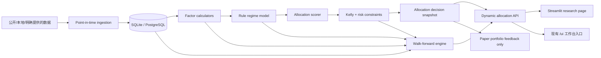

# 动态资产配置与风险控制系统架构

- Status: active
- Owner group: Research and AI Workflows
- Last updated: 2026-07-17
- Related tasks: T-581, T-582, T-583, T-584, T-585, T-586, T-587, T-588, T-589
- Scope: 动态资产配置的数据、因子、模型、风险、回测、API、Streamlit 页面和纸面运行架构
- Non-goals: 短期价格预测、真实券商连接、自动下单、在本阶段训练模型或生成实盘建议

## 1. Purpose

本文把《动态资产配置与因子模型深度报告》转成可逐阶段实施的软件架构。系统输出的是 `SPY + QQQ` 的目标股票仓位及其解释，不是买卖信号。所有组合、调仓和反馈均为 paper-only。

第一阶段资产池固定为 `SPY`、`QQQ`、`SGOV`；第二阶段才评估 `TLT` 和 `GLD`；`SQQQ` 只允许作为第三阶段的小仓位、短周期、硬退出对冲工具，不能进入长期战略配置。

## 2. Facts, Decisions, Assumptions, Open Questions

### 2.1 Facts

- 项目已有 `MarketDataPoint`、`PortfolioProposal`、`PortfolioTransaction`、组合收益/估值/回放 API、审计日志和 SQLite/PostgreSQL adapter。
- PostgreSQL 已使用 typed `ai_quant.market_data_bars` 保存高容量行情；其余低容量领域对象主要保存在 `ai_quant.records` JSONB 表。
- 当前产品入口是 `/ui` 静态单页工作台，`SystemService` 必须保持兼容 facade，新增业务逻辑默认不能继续堆入 `app/services.py`。
- T-589 已接入 FRED、Cboe、FINRA 和受治理 Yahoo EOD 的免密公开数据管道；动态因子库保存月末加最新的派生快照，原始日线仍留在行情源。

### 2.2 Decisions

- 不复制请求中的独立 `project/` 根目录；新增 `app/dynamic_allocation/` 领域包，复用现有 store、API、审计、配置和 paper-only 边界。
- `SystemService` 只增加薄 facade；数据、因子、模型、风险和回测逻辑全部进入领域包。
- Streamlit 是独立展示进程，只调用项目 API，不直接读数据库，也不在页面内重复计算因子或仓位。现有 `/ui` 增加“动态配置”入口，打开该研究页。
- 高频/高容量时间序列使用 typed SQL 表；低容量配置、运行摘要、决策快照和模型说明继续使用现有 record/store 模式。
- 所有因子分数统一为 `0-100`，且方向统一为“越高越支持承担股票风险”。例如 `volatility_score=90` 表示波动环境温和，不表示 VIX 很高。
- 缺失数据不得静默填成中性分。每次评分必须输出覆盖率、缺失因子、过期因子和是否允许形成仓位。
- 第一版只做规则状态机和加权评分；复杂模型只有在 walk-forward 样本外稳定超过规则基线后才可提升。

### 2.3 Assumptions

- 默认受众是单个个人研究者，日频数据、月频主调仓、重大风险事件临时复评足够。
- 本地开发使用 SQLite；长期本机运行优先 PostgreSQL。
- 免费公开源不足以提供历史 Forward PE、FCF Yield、专有 ISM 或 survivorship-safe 成分股宽度，因此当前实现使用显式代理并禁止其 current-vintage 回填参与历史 PIT 证据声明。

### 2.4 Open Questions

- 若要将代理升级为原始指标，需要取得许可明确且提供历史 vintage/release calendar 的数据源；升级前规则模型必须保持代理标签。
- 当前 FRED 回填是 acquisition-date current vintage，不是 ALFRED 实时 vintage。历史 walk-forward 仍需另行接入真实 vintage 数据。
- `SPY:QQQ` 股票内部权重第一版按报告固定为 `70:30`，后续是否配置化调整需要样本外证据。

## 3. Target Topology



核心约束：页面只显示服务端已经版本化并审计的结果；任何一次仓位都能回查到原始数据 vintage、因子版本、配置版本、模型版本和风险裁剪原因。

## 4. Repository Structure

```text
app/
├── dynamic_allocation/
│   ├── __init__.py
│   ├── contracts.py             # 协议、输入输出 DTO、枚举
│   ├── config.py                # YAML 读取、校验、配置 hash
│   ├── service.py               # DynamicAllocationService 应用编排
│   ├── data/
│   │   ├── providers.py         # Provider protocol 与 provider registry
│   │   ├── point_in_time.py     # available_at/vintage 查询规则
│   │   ├── repository.py        # SQLite/PostgreSQL repository protocol
│   │   ├── market_adapter.py    # 复用 MarketDataPoint/market_data_bars
│   │   └── quality.py           # freshness、coverage、revision 检查
│   ├── factors/
│   │   ├── base.py              # FactorCalculator、FactorResult
│   │   ├── valuation.py
│   │   ├── trend.py
│   │   ├── volatility.py
│   │   ├── credit.py
│   │   ├── leverage.py
│   │   ├── macro.py
│   │   ├── liquidity.py
│   │   └── breadth.py
│   ├── models/
│   │   ├── regime_rules.py
│   │   ├── regime_hmm.py         # Phase 4，HMM/Markov switching 对照
│   │   ├── allocation_score.py
│   │   ├── linear.py            # Phase 4
│   │   └── tree.py              # Phase 4
│   ├── portfolio/
│   │   ├── universe.py
│   │   ├── allocation.py
│   │   └── rebalance.py
│   ├── risk/
│   │   ├── kelly.py
│   │   ├── limits.py
│   │   └── warnings.py
│   └── backtest/
│       ├── engine.py
│       ├── walk_forward.py
│       ├── benchmarks.py
│       ├── metrics.py
│       └── leakage_checks.py
├── api.py                       # 仅增加薄 handler
├── api_routes.py                # /api/dynamic-allocation/*
├── models.py                    # 低容量持久对象 DTO
├── services.py                  # 仅兼容 facade 委托
└── store.py                     # 低容量 collection 与 typed repository 接线

config/
└── dynamic_allocation.yaml

dashboard/
├── dynamic_allocation_app.py    # Streamlit 入口，只消费 API
├── api_client.py
└── views/
    ├── current.py
    ├── history.py
    ├── backtest.py
    └── data_quality.py

scripts/
├── dynamic_allocation_ingest.py
├── dynamic_allocation_evaluate.py
└── dynamic_allocation_backtest.py

tests/
└── dynamic_allocation/
    ├── fixtures/
    ├── test_point_in_time.py
    ├── test_repositories.py
    ├── test_factors.py
    ├── test_regime_rules.py
    ├── test_risk_limits.py
    ├── test_walk_forward.py
    └── test_api.py
```

`main.py` 不另建：现有 `python3 -m app.server` 仍是主 API 入口；Streamlit 使用独立入口 `streamlit run dashboard/dynamic_allocation_app.py`。

## 5. Database Design

### 5.1 Storage Split

| Storage | Purpose | Reason |
|---|---|---|
| existing `market_data_bars` | SPY/QQQ/SGOV/TLT/GLD/SQQQ 日线 | 已有 typed、高容量查询路径 |
| `economic_observations` | 宏观、估值、VIX、信用、杠杆、流动性、宽度原始观测及 vintage | 必须按发布时间和修订版本查询 |
| `factor_values` | 每日/每月因子原值、分数、覆盖率和解释 | 供审计、页面和回测复用 |
| existing `records` | series 定义、配置快照、模型版本、状态/仓位决策、运行摘要 | 低容量、适合现有 store 模式 |
| `backtest_points` | 回测净值、仓位、回撤、换手及基准曲线 | 运行点数量大，不应全部塞 JSONB |
| existing `audit_log` | 数据、评分、模型、决策和人工覆盖事件 | 复用当前审计契约 |

### 5.2 Point-in-time Observation

`economic_observations` 最小字段：

| Field | Meaning |
|---|---|
| `observation_id` | 稳定唯一 ID |
| `series_id` | 规范序列 ID，例如 `fred:UNRATE` |
| `observation_date` | 指标对应经济/市场日期 |
| `value` | 数值 |
| `release_date` | 来源正式发布日期 |
| `available_at` | 系统允许模型使用的精确时间，含时区和发布延迟 |
| `vintage_date` | 该版本所属 vintage 日期 |
| `revision_seq` | 同一 observation 的修订序号 |
| `source_id` | 回链 `SourceDefinition` |
| `source_uri` | 可审计来源地址，不允许签名临时 URL |
| `ingested_at` | 入库时间 |
| `rights_tag` | 来源权利和用途边界 |
| `quality_flags` | 缺失、异常、代理序列等标记 |
| `payload_hash` | 幂等和变更追踪 |

唯一键：`(series_id, observation_date, vintage_date, revision_seq)`。

关键查询语义：在回测时点 `t`，只允许选择 `available_at <= t` 的记录；同一 `series_id + observation_date` 选择当时已知的最新 vintage。修订值只新增版本，不覆盖旧版本。

### 5.3 Factor Value

`factor_values` 字段：

- `factor_value_id`, `as_of_date`, `factor_name`, `factor_version`
- `raw_value`, `normalized_value`, `score`, `score_direction`
- `component_values`, `component_contributions`
- `data_cutoff_at`, `source_observation_ids`
- `coverage_ratio`, `freshness_status`, `quality_flags`
- `config_hash`, `computed_at`, `run_id`

唯一键：`(as_of_date, factor_name, factor_version, config_hash)`。

### 5.4 Decision Snapshot

低容量 `DynamicAllocationDecision` 保存：

- `decision_id`, `as_of_date`, `evaluated_at`, `status`
- `regime`, `regime_probabilities`, `regime_explanation`
- 八类因子分数、贡献、覆盖率和缺失项
- `raw_equity_score`, `bucket_equity_weight`
- `kelly_cap`, `risk_cap`, `maximum_allocation`
- `target_equity_weight`, `target_sgov_weight`
- `spy_weight`, `qqq_weight`, `rebalance_delta`
- `warnings`, `model_version`, `factor_version`, `config_hash`
- `paper_only=true`, `live_execution_allowed=false`, `broker_connected=false`

### 5.5 Backtest Storage

`BacktestRun` 摘要保存在 records，包含参数、训练/测试窗口、数据 cutoff、代码/config hash、指标和 artifact 引用。`backtest_points` 保存每个交易日的策略/基准净值、目标/实际仓位、现金收益、成本、回撤和 regime。

SQLite 与 PostgreSQL 必须实现同一 repository contract；SQLite 用同名 typed tables，PostgreSQL 使用 `ai_quant` schema 和必要复合索引。数据库差异不能泄漏到因子或模型层。

## 6. Core Class Design

### 6.1 Data Contracts

```python
class ObservationProvider(Protocol):
    def fetch(self, request: FetchRequest) -> list[PointInTimeObservation]: ...

class ObservationRepository(Protocol):
    def upsert(self, rows: Sequence[PointInTimeObservation]) -> UpsertSummary: ...
    def latest_available(self, series_ids: Sequence[str], as_of: datetime) -> list[PointInTimeObservation]: ...
    def vintages(self, series_id: str, observation_date: date) -> list[PointInTimeObservation]: ...
```

Provider 只负责获取和标准化；repository 负责幂等、vintage 保存和 point-in-time 查询；quality service 负责决定数据能否进入自动评分。

行情同样遵守可用时间：日线收盘数据只能在配置的交易所收盘时间和接收延迟之后使用；基于当日收盘计算的信号最早在下一可交易时点成交，不能按同一个收盘价回填成交。

### 6.2 Factor Contracts

```python
class FactorCalculator(Protocol):
    name: str
    version: str

    def required_series(self) -> set[str]: ...
    def calculate(self, context: FactorContext) -> FactorResult: ...
    def explain(self, result: FactorResult) -> list[Contribution]: ...
```

每个 `FactorResult` 必须包含 `raw_values`、`score`、`contributions`、`coverage_ratio`、`data_cutoff_at`、`source_observation_ids` 和 `warnings`。历史百分位只使用 `as_of` 之前的数据，并配置最小历史窗口。

### 6.3 Model Contracts

- `RuleRegimeClassifier.classify(factors) -> RegimeResult`
  - 状态为 `risk_on`、`late_cycle`、`risk_off`、`crisis`、`recovery`。
  - 规则有优先级、滞后区间和最短驻留期，避免单日频繁反转。
- `AllocationScorer.score(factors, regime) -> AllocationScore`
  - 输出连续分和五档候选仓位。
  - 输出每个因子的正负贡献及裁剪过程。
- Phase 4 的 `LinearAllocationModel` 和 `TreeAllocationModel` 实现相同接口；模型不能绕过风险层。
- Phase 4 同时加入 `HiddenMarkovRegimeClassifier` 或 statsmodels Markov switching 对照；状态必须映射回五个业务 regime，并输出状态概率、主要驱动和稳定性诊断。

### 6.4 Portfolio and Risk Contracts

- `AllocationPolicy`：把股票总仓位拆成 `SPY 70% + QQQ 30%`，余额为 SGOV；处理 10/30/50/70/90 五档。
- `RebalancePolicy`：月度主调仓、10 个百分点 no-trade buffer、单次最多调整 10%-15%、升仓分批、重大风险事件复评。
- `FractionalKellySizer`：只支持 quarter/half Kelly，绝不返回 full Kelly。
- `RiskLimitPolicy`：永久损失预算、最大股票仓位、资产上限、相关性上限、数据质量上限。
- `RiskDecision`：保存每个 cap 的数值和最终采用最小值的原因。

凯利输入必须定义分布，不能仅凭 `expected_return + probability + volatility` 推导唯一答案：

- 二项情景模式使用 `p_win`、`avg_gain`、`avg_loss` 求原始 Kelly，再乘 `0.25` 或 `0.5`。
- 连续收益模式使用 `mu / sigma^2` 近似；概率只用于置信度收缩，不重复计入期望收益。
- 输入不足、波动率接近零、样本不足或估计不稳定时，Kelly cap 返回 unavailable，最终仓位由更保守的 risk/max cap 决定并显示警告。

### 6.5 Backtest Contracts

`WalkForwardBacktester` 必须：

1. 按 `available_at` 构造每个决策时点的数据快照。
2. 训练窗和测试窗物理隔离；测试窗内不重估历史阈值。
3. 在下一个可交易时点执行信号，计入成本、滑点和 SGOV/现金代理收益。
4. 输出 CAGR、Annual Return、Maximum Drawdown、Sharpe、Sortino、Calmar、Win Rate、Turnover。
5. 对比 100% SPY、60/40 SPY/现金代理、QQQ Buy & Hold、SPY 200MA。

`SGOV` 在 2000 年尚无可交易历史，因此 2000/2008 回测必须使用经配置且明确标记的 3-month Treasury total-return proxy；HYG 等上市前数据不得反向拼接为真实 ETF 历史。所有代理序列必须出现在回测报告和页面警告中。

## 7. Configuration Design

`config/dynamic_allocation.yaml` 管理：

- 资产池、股票内部权重、资产生效日期和代理序列。
- 数据 source、series mapping、发布时间延迟、时区、最大陈旧天数。
- 因子组件、方向、winsorize、历史百分位窗口、最小覆盖率和权重。
- regime 规则、优先级、滞后阈值和最短驻留期。
- 五档仓位阈值、调仓缓冲、最大单次变化。
- Kelly 模式、fraction、样本窗和 cap。
- 交易成本、滑点、税费假设和 benchmark。
- walk-forward 训练窗、测试窗、再训练频率和随机种子。

每次运行保存完整 config snapshot 与 SHA-256；页面显示版本，不只显示当前 YAML。

## 7.1 Public Data Pipeline

`scripts/backfill_dynamic_allocation_public_data.py` 调用 `app/dynamic_allocation/data/public_pipeline.py`，产生配置注册的全部 38 个序列。来源和口径如下：

| Family | Direct source | Explicit proxy |
|---|---|---|
| Valuation | FRED DGS10 | SPY 相对 5/10 年均值构造 Forward PE/CAPE cycle proxy，进而派生 earnings/FCF yield 与 ERP |
| Trend | Yahoo SPY adjusted close | none |
| Volatility | Cboe VIX and VIX3M | none |
| Credit | FRED ICE BofA spreads, Yahoo HYG | none |
| Leverage | FINRA margin balances, FRED US equity market value | none |
| Macro | FRED employment, claims, CPI/PCE and INDPRO | INDPRO diffusion proxy for PMI/ISM |
| Liquidity | FRED balance sheet, TGA, reverse repo, broad dollar and NFCI | broad dollar index substitutes for literal DXY |
| Breadth | Yahoo RSP and SPY | equal-weight trend/high/relative-return proxies |

每条 observation 保存 source URI、上游序列、公式、代理标记、采样方式和 acquisition vintage。历史公开值统一在本机取得日才变为 `available_at`，因此不会伪造过去已知状态。应用层同时要求八因子 ready 和关键底层 Data Health fresh，任一条件失败均返回空仓位。

## 8. API Boundary

计划 API：

| Method | Path | Purpose |
|---|---|---|
| `GET` | `/api/dynamic-allocation/current` | 当前状态、因子、仓位、解释和 freshness |
| `POST` | `/api/dynamic-allocation/evaluate` | 按指定 as-of 生成可审计决策快照 |
| `GET` | `/api/dynamic-allocation/history` | 历史 regime、因子和仓位 |
| `GET` | `/api/dynamic-allocation/data-health` | 序列覆盖、最新发布时间、缺失和过期状态 |
| `POST` | `/api/dynamic-allocation/data/ingest` | 小批导入或 provider 运行；写操作需幂等键 |
| `POST` | `/api/dynamic-allocation/backtests` | 创建 walk-forward 回测 run |
| `GET` | `/api/dynamic-allocation/backtests/{run_id}` | 回测指标、曲线和泄漏检查结果 |
| `GET` | `/api/dynamic-allocation/config/schema` | 可配置字段和约束 |

全部响应复用统一 `success/data/error/trace_id`，写操作写入 audit。任何响应都固定返回 paper-only 边界。

## 9. Streamlit Page Contract

页面定位为个人研究和复盘工具，不是交易终端。默认视图无需点击即可回答四个问题：当前是什么状态、目标仓位多少、为什么、数据是否足够新。

页面结构：

1. 顶部摘要：market regime、目标股票仓位、SGOV 仓位、as-of、数据 freshness、paper-only 标识。
2. 因子评分：八个统一方向的横向评分条；点击查看原始值、历史分位、贡献和来源时间。
3. 配置解释：评分仓位、Kelly cap、risk cap、maximum allocation 和最终取最小值过程。
4. 历史：仓位/净值时间线与 regime 背景，不把不可比较量塞进同一坐标轴。
5. 回测：策略与四个基准、回撤、滚动风险指标和压力年份切片。
6. 数据质量：每个序列的 source、observation date、release date、available time、vintage、freshness 和 proxy 标识。
7. 风险警告：缺失关键因子、代理序列、模型分歧、仓位跳变和人工覆盖记录。

Streamlit 只通过 API client 获取数据；使用 `st.cache_data` 缓存确定性只读请求，不持有业务状态。Phase 6 再把它加入 Compose 并从 `/ui` 导航打开。

## 10. Development Roadmap

| Phase | Task | Deliverable | Exit gate |
|---|---|---|---|
| Architecture | T-581 | 本文、数据库和分阶段边界 | 文档/handoff 校验通过 |
| Phase 1 | T-582 | PIT 数据模型、typed tables、provider/repository、数据健康 | fixture + SQLite + PostgreSQL contract tests；无模型训练 |
| Phase 2 | T-583 | 八类因子和可解释 factor dataframe | 无未来数据、分数方向一致、覆盖率可见 |
| Phase 3 | T-584 | 规则 regime、五档仓位、首次 walk-forward | 2000/2008/2020/2022 切片及四基准 |
| Phase 4 | T-585 | HMM/Markov switching、Logistic/Ridge 与 XGBoost 对比 | 样本外稳定；否则保留规则模型 |
| Phase 5 | T-586 | Fractional Kelly 与风险裁剪 | quarter/half only，边界和异常覆盖 |
| Phase 6 | T-587 | Streamlit 页面和 `/ui` 入口 | 真实 API 图表/表格、窄屏和错误态验收 |
| Phase 7 | T-588 | paper portfolio 日志与复盘 | 运行 6-12 个月；无券商、无自动下单 |

依赖按阶段增加：Phase 1/2 增加 pandas、numpy、PyYAML、scipy/statsmodels；Phase 3/4 再增加 scikit-learn 和可选 xgboost/lightgbm，HMM 优先复用 statsmodels Markov switching，只有证据充分时才增加 hmmlearn；Phase 6 增加 Streamlit/Plotly。重型 ML 依赖不能提前进入默认安装。

## 11. Phase 1 Implementation Plan

Phase 1 只建立可信数据底座，不计算最终因子、不训练模型、不生成仓位。

### 11.1 Work Packages

1. 配置与契约
   - 建立 YAML schema、series registry、provider protocol、PIT DTO 和配置 hash。
   - 固定时区、`release_date`、`available_at`、vintage 和 freshness 定义。
2. 存储
   - 为 SQLite/PostgreSQL 增加 `economic_observations` typed table、索引和 repository contract。
   - 增加幂等 upsert、vintage 查询、as-of 查询和数据覆盖统计。
3. 数据接入
   - 先接 local CSV/JSON fixture、现有 `market_data_bars` adapter。
   - 为 FRED/ALFRED 等公开源预留 provider；只有完成 source governance 后才启用自动导入。
4. 数据质量
   - 校验重复、空值、异常值、时间倒置、未知时区、缺失 release date、修订覆盖和陈旧度。
   - 输出 `ready_for_factor_calculation`，关键序列缺失时明确 false。
5. API 与 CLI
   - 实现 ingest preview/execute、data-health 和 series coverage。
   - 所有写入记录 idempotency key、config hash、source 和 audit。
6. 测试与证据
   - 构造包含初值与修订值的 fixture，证明回测日期只能看到当时 vintage。
   - 验证 SQLite/PostgreSQL repository 行为一致；PostgreSQL 不可用时明确记录跳过原因。

### 11.2 Phase 1 Acceptance

- 给定同一 CPI observation 的初值和后续修订值，历史 as-of 查询返回当时可见版本。
- 未来 `available_at` 数据不能进入查询结果。
- 重复导入不增加行数，payload 变化产生新 vintage 或可审计更新。
- SPY/QQQ/SGOV 行情通过现有 adapter 读取，不复制保存。
- 数据健康输出 source、grain、coverage、freshness 和缺口；不把缺失当作 50 分。
- `SystemService` 只保留 facade 委托，聚焦回归保护 API 兼容。
- 保持 `paper_only=true`、`live_execution_allowed=false`、`broker_connected=false`。

建议验证命令：

```bash
python3 -m py_compile app/*.py app/dynamic_allocation/**/*.py tests/dynamic_allocation/*.py scripts/*.py
python3 -m unittest discover -s tests/dynamic_allocation
python3 -m unittest discover -s tests
python3 scripts/ui_static_check.py
python3 scripts/security_check.py .
python3 scripts/check_handoffs.py
```

## 12. Risks and Controls

| Risk | Control |
|---|---|
| 当前成分股计算历史宽度导致幸存者偏差 | 只接受 PIT 成分或治理后的聚合宽度序列；否则 unavailable |
| 宏观修订值穿越 | 保存所有 vintage，严格按 `available_at` 查询 |
| ETF 上市前历史不足 | 使用显式 proxy 并在指标和页面标记，不伪装成 ETF 实盘历史 |
| 因子缺失被误当中性 | coverage gate + missing warning + 阻止关键评分 |
| 状态频繁反转 | hysteresis、最短驻留期、月度调仓和 no-trade buffer |
| Kelly 对估计误差敏感 | quarter/half、置信度收缩、risk cap、异常时不可用 |
| 复杂模型过拟合 | walk-forward、参数平台、基线比较、稳定性优先 |
| Streamlit 与主系统逻辑分叉 | 页面只消费 API，禁止页面内复制模型逻辑 |
| 组合语义滑向实盘 | paper-only 字段、权限、审计和无 broker connector 结构性约束 |

## 13. Completion Boundary

T-581 完成只代表架构和实施顺序已确定。系统在 T-582 至 T-588 分阶段交付前，不能声称已经具备真实动态配置、回测或纸面运行能力。
