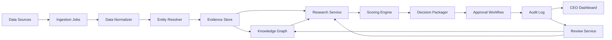

# 系统架构设计

## 1. 目标

将 AI Native 虚拟量化基金组织落到可开发的系统架构，明确模块边界、数据流、部署拓扑、技术栈和失败降级策略。

## 2. 架构原则

- 统一治理，分市场执行
- 数据与模型解耦
- 研究、治理、执行、复盘四层分离
- 先 batch-first，后事件驱动
- 任何可执行动作都必须经过审计与审批

## 3. 总体分层

### 3.1 数据接入层

职责：

- 接入 A/H/U 三市场公开披露
- 接入公开/已提供 EOD/延时行情
- 接入本地研报、公告和结构化财务数据

核心组件：

- `ingestion-jobs`
- `source-registry`
- `rights-tagging`

### 3.2 数据治理层

职责：

- 清洗、去重、标准化
- 统一用途标签和来源标签
- 生成主键映射和元数据

核心组件：

- `data-normalizer`
- `entity-resolver`
- `metadata-store`

### 3.3 证据与知识层

职责：

- 保存原文切片、证据定位和研究结论
- 建立主体图谱、文件图谱和观点图谱

核心组件：

- `evidence-store`
- `knowledge-graph`
- `thesis-registry`

### 3.4 研究与评分层

职责：

- 生成公司/行业/事件研究卡
- 运行长线/短线评分
- 运行 13F 拥挤度和双语抽取

核心组件：

- `research-service`
- `scoring-engine`
- `benchmark-evaluator`

### 3.5 决策治理层

职责：

- 生成投委会 Pack
- 运行 Reg FD 闸门和 prompt 审批
- 记录人工签字和例外事项

核心组件：

- `decision-packager`
- `approval-workflow`
- `audit-log`

### 3.6 经营与复盘层

职责：

- 展示 CEO Dashboard
- 输出复盘、归因和 challenger 结果
- 维护事故剧本和演练状态

核心组件：

- `ceo-dashboard`
- `review-service`
- `incident-playbook`

## 4. 组件关系

## 5. 部署拓扑

### 5.1 MVP 建议

- API 服务：单体后端分模块部署
- 任务调度：批处理为主
- 存储：关系型数据库 + 对象存储 + 向量/图谱存储
- 缓存：按需使用

### 5.2 建议组件

| 层 | 方案 | 说明 |
|---|---|---|
| API | FastAPI | 统一后端入口 |
| Web | Next.js | Dashboard 与管理界面 |
| 任务编排 | Airflow 或 Cron | MVP 阶段优先 batch-first |
| 关系数据库 | PostgreSQL | 存储主数据、审批、配置 |
| 对象存储 | S3 兼容存储 | 保存原文、PDF、解析结果 |
| 检索 | OpenSearch / Elasticsearch | 文本搜索与过滤 |
| 向量检索 | Qdrant | 证据、研究卡、语义检索 |
| 图谱 | Neo4j | 主体与关系图谱 |
| 监控 | OpenTelemetry | 日志、指标、链路 |

当前代码落地状态：MVP 默认使用 SQLite、本地对象存储和内置全文检索；状态库已抽象为 SQLite / PostgreSQL adapter，PostgreSQLStore 使用 [生产状态库基线 schema](./postgresql-schema.sql) 的 JSONB records 与独立审计表；对象存储已抽象为 local / S3-compatible adapter，检索已抽象为 local / OpenSearch-compatible adapter，并支持外部检索失败时回退到本地检索。Qdrant、Neo4j、OpenTelemetry、真实外部环境压测和运维策略属于下一阶段生产部署适配。

## 6. 核心流程

### 6.1 披露到研究卡

1. 采集原始文件
2. 打来源和用途标签
3. 解析文本与表格
4. 切片并入证据库
5. 提取实体和事实
6. 生成研究卡
7. 写入证据回链

### 6.2 研究到决策

1. 研究卡进入评分系统
2. 评分结果进入投委会 Pack
3. 触发 Reg FD / 权限 / 风险校验
4. 人工签字
5. 记录审计日志

### 6.3 决策到复盘

1. 生成执行意图
2. 记录最终结果
3. 进行归因与 challenger 对比
4. 更新知识图谱与复盘记录

## 7. 降级策略

- 模型不可用时，允许规则基线接管摘要与抽取
- 向量检索不可用时，允许原文搜索回退
- 图谱不可用时，允许关系表回退
- 审批工作流不可用时，禁止进入执行意图

## 8. 开发建议

### 8.1 首批模块

- 公开来源矩阵
- 原始资料入湖
- Thesis Card
- benchmark
- 双评分卡
- 投委会 Pack
- 审计日志
- CEO Dashboard

### 8.2 首批非功能要求

- 全链路留痕
- 可回放
- 可回链
- 可灰度
- 可降级
