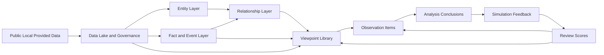

# 公司情报平台系统架构设计

- Status: active
- Owner group: Platform and Quality
- Last updated: 2026-06-24
- Related tasks: T-431, T-432, T-433, T-434, T-435, T-436
- Scope: 公司情报平台目标架构、分层、数据流、兼容边界和部署口径
- Non-goals: 真实券商执行、自动交易、以组织签批作为主流程

## 1. Purpose

本文档定义项目重定位后的目标架构。系统主线从“研究-决策-执行-复盘”调整为“数据-实体-事件-关系-观点-反馈”，服务对象是公司级情报数据库、市场综合分析、研报观点追踪、个人分析记录和模拟反馈验证。

现有代码中的决策包、审批、执行意图和组织看板能力不删除，但降级为兼容模块。当前主路径已围绕公司画像、事件时间线、关系图谱、观点库、观察任务和模拟反馈展开。

## 2. Architecture Principles

- 公司数据库先于结论：先沉淀公司、证券、事件、关系和证据，再输出分析。
- 事实和观点分层：公告、财报、监管披露、行情等进入事实层；研报和个人判断进入观点层。
- 研报是一等观点对象：用于关注度、结构化观点、目标价/预测跟踪和分析师可靠性复盘。
- 模拟交易只是反馈工具：只验证分析有效性，不连接真实券商，不触发真实订单。
- 数据可信度与可复盘优先：保留来源、权利边界、证据定位、版本和审计。
- Batch-first，local-first：本机长期可用优先，外部生产发布门禁作为运维附录。
- 兼容迁移：保持现有 API 和 `SystemService` facade 稳定，逐步迁移命名和 UI。

## 3. Target Layers

### 3.1 Data Lake and Governance Layer

职责：

- 入湖公开/本地/明确提供的数据。
- 记录来源、权利边界、采集时间、原文对象、缓存策略和用途边界。
- 生成可审计 evidence、document、artifact 和 ingestion job。

典型对象：

- `SourceDefinition`
- `Document`
- `Evidence`
- `IngestionJob`
- `SourceReviewRecord`
- `ManualReviewItem`

现有能力映射：

- A/H/U connector、本地通达信行情、SEC/HKEX/A 股公告、本地研报资产库、对象存储、检索、rights tag、source governance。

### 3.2 Entity Layer

职责：

- 建立公司和证券主数据。
- 统一人物、机构、产品、产业链节点、主题节点等实体。
- 管理 A/H/U、CIK、FIGI、ISIN、ticker、LEI 等映射和置信度。

核心实体：

- 公司：`CompanyProfile` / existing `Issuer`
- 证券：`Security`
- 人物：`Person`
- 机构：`Institution`
- 产品：`Product`
- 产业链节点：`IndustryChainNode`
- 主题：`Theme`

主键：

- `issuer_id`
- `security_id`
- `person_id`
- `institution_id`
- `product_id`
- `industry_node_id`
- `theme_id`

### 3.3 Fact and Event Layer

职责：

- 保存可回链事实和公司事件。
- 将行情、财务、公告、新闻、政策、订单、诉讼、价格和供需变化统一到事件时间线。
- 明确事实来源、证据、置信度、发生时间和影响标签。

核心对象：

- `MarketDataPoint`
- `FinancialMetric`
- `CorporateAction`
- `CompanyEvent`
- `DisclosureEvent`
- `ExtractionResult`

事件类型示例：

- `financial_report`
- `announcement`
- `policy_change`
- `news`
- `order_contract`
- `litigation`
- `management_change`
- `supply_demand`
- `price_move`
- `capital_action`

### 3.4 Relationship Layer

职责：

- 建立公司、证券、人物、机构、产品、产业链和主题之间的关系。
- 支持客户、供应商、竞争、股权、机构覆盖、分析师覆盖、上下游、主题关联和事件关联。
- 记录关系来源、方向、权重、有效期和置信度。

核心对象：

- `CompanyRelationship`
- `EntityMapping`
- `InstitutionalHolding`
- `AnalystCoverage`
- `ThemeMembership`

关系类型示例：

- `customer_of`
- `supplier_of`
- `competitor_of`
- `owns_equity`
- `covered_by_institution`
- `covered_by_analyst`
- `upstream_of`
- `downstream_of`
- `related_to_theme`

### 3.5 View and Feedback Layer

职责：

- 管理研报观点、个人假设、观察任务、分析结论和模拟反馈。
- 把观点与事实、事件和关系进行交叉验证。
- 复盘机构、分析师和个人结论的可靠性。

核心对象：

- `ResearchReport`
- `ReportViewpoint`
- `ReportForecast`
- `AnalystProfile`
- `AnalystReliabilityScore`
- `ObservationItem`
- `AnalysisConclusion`
- `SimulationFeedback`

边界：

- 研报进入观点层和关注度信号，不直接覆盖事实层。
- 模拟反馈固定 paper-only，不生成真实执行指令。
- 旧 `DecisionPack`、`ExecutionIntent` 和组织签批对象保留为兼容模块。

## 4. Main Data Flow



固定业务流程：

```text
数据入湖 -> 公司画像 -> 事件时间线 -> 关系图谱 -> 多源观点 -> 观察任务 -> 分析结论 -> 模拟反馈
```

## 5. Layer Contracts

### 5.1 Facts vs Views

事实层允许来源：

- 监管披露
- 交易所公告
- 公司 IR 和正式公告
- 公开/已提供行情和财务数据
- 已审查的公开网页/API

观点层允许来源：

- 研报
- 个人笔记
- 模型摘要
- 结构化分析结论
- 外部观点引用

规则：

- 观点可以引用事实，不能反向覆盖事实。
- 研报中的目标价、评级、盈利预测和核心假设是观点字段。
- 研报提到的事实必须另行回链公告、财报、监管披露或可信公开来源。

### 5.2 Simulation Feedback Boundary

模拟反馈层允许：

- 记录模拟买卖、观察组合、收益表现、假设兑现、事件验证和复盘结论。
- 关联 `analysis_conclusion_id`、`observation_id`、`event_id` 和 `security_id`。

模拟反馈层禁止：

- 连接真实券商。
- 自动下单。
- 把模拟结果变成真实执行动作。

固定字段：

- `paper_only=true`
- `live_execution_allowed=false`
- `broker_connected=false`

### 5.3 Compatibility Modules

以下模块保留但不作为主路径：

- Decision governance
- Committee pack
- Electronic signature
- Execution intent
- CEO/organization dashboard
- Non-local production release gate

兼容策略：

- API 可继续返回旧字段。
- 文档和 UI 应把旧对象标为 compatibility 或 operations appendix。
- 新功能优先使用 `ObservationItem`、`AnalysisConclusion` 和 `SimulationFeedback`。

## 6. Deployment Topology

### 6.1 Local-first MVP

| Capability | Default | Optional Adapter |
|---|---|---|
| API | Python app server | Same service behind reverse proxy |
| State store | In-memory or SQLite | PostgreSQL |
| Object store | Local directory | S3-compatible |
| Text search | Built-in local search | OpenSearch-compatible |
| Graph | Query from stored relationships | Neo4j |
| Vector search | Local semantic fallback | Qdrant |
| Orchestration | Scripts / cron / internal DAG | Airflow / Dagster later |
| Observability | Logs and artifacts | OpenTelemetry |

### 6.2 Operations Appendix

Production/readiness/release gate artifacts are operations concerns. They remain useful for external staging or organization-level release, but they are not the current product roadmap center.

Operations documents:

- `docs/production-runbook.md`
- `docs/artifact-governance.md`
- `artifacts/production-closure-manifest.example.json`
- readiness and release scripts under `scripts/`

## 7. Existing Implementation Mapping

| Existing Area | New Interpretation |
|---|---|
| `Issuer` / `Security` | Entity layer foundation for company and security |
| `Document` / `Evidence` | Data lake, source governance and evidence back-link |
| Market data / financial data | Fact layer |
| Disclosure event / corporate action | Company event timeline |
| Graph query | Relationship layer and company intelligence graph |
| Research reports | Viewpoint library and attention signal |
| Thesis / Research card | Analysis conclusion compatibility object |
| Decision pack | Optional compatibility module |
| Execution intent | Deprecated core path; simulation input compatibility only |
| Simulated ledger | Simulation feedback layer |
| Operating reports | Review and feedback summaries |
| Readiness gate | Operations appendix |

## 8. Failure and Degradation Strategy

- LLM unavailable: use rule extraction and mark model fallback.
- OCR unavailable: preserve document metadata and create manual review item.
- External search unavailable: use local search fallback.
- Graph store unavailable: query relationship records from state store.
- Report parsing low confidence: keep report as asset and create extraction review task.
- Simulation feedback unavailable: analysis conclusion can still be recorded; feedback status remains pending.
- Source boundary unclear: data enters manual reference only.

## 9. Completed Baseline And Development Priorities

1. T-431 completed documentation and roadmap alignment with company intelligence positioning.
2. T-432 completed company profile schema/API mapping to existing issuer/security records.
3. T-433 completed first-class event timeline and relationship records with graph backlinks.
4. T-434 completed structured report viewpoints, forecasts and analyst reliability scoring baseline.
5. T-435 completed observation, conclusion and paper-only simulation feedback contracts.
6. T-436 completed UI information architecture reframing around the company intelligence workbench.

Next development should improve scoring depth, visual company pages, batch ingestion quality and external graph/vector adapters without moving the product back to an execution-centered workflow.

## 10. Open Questions

- Which existing API names should be preserved indefinitely, and which can be renamed behind compatibility aliases?
- When should company relationships migrate from relational records to graph-native storage?
- Which report fields should require stricter manual review before reliability scoring?
- How should non-trading observation feedback be scored against conclusions beyond the current baseline metrics?
- What is the minimum company profile coverage needed before the workbench is useful day to day?
